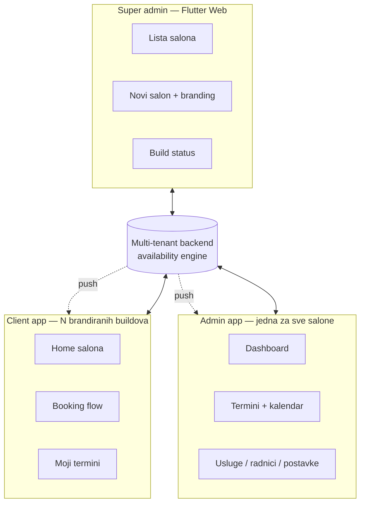
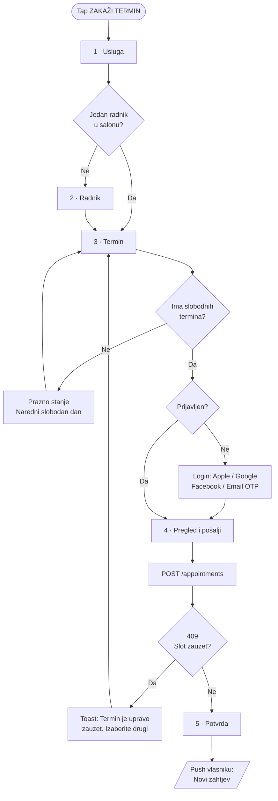
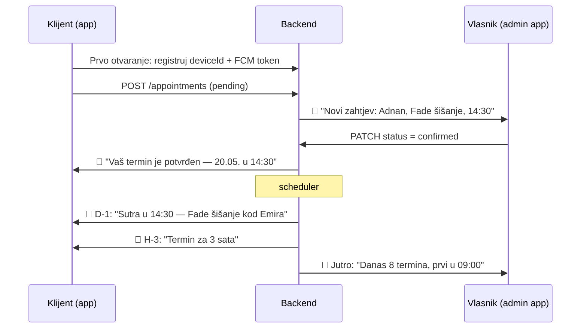
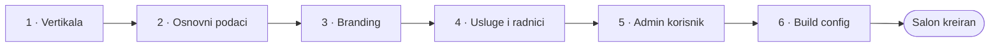
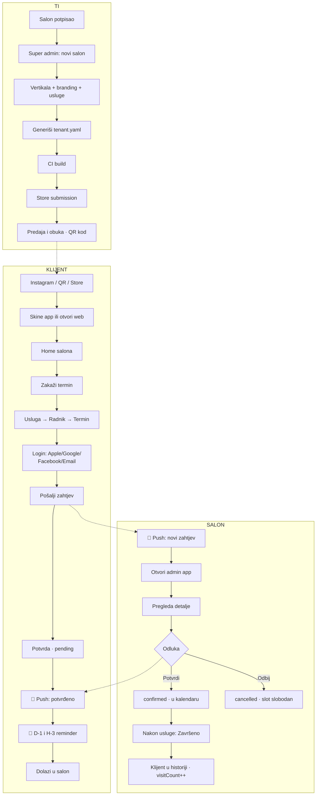

# User Flows & Wireframes — Faza 2

UX specifikacija za native Flutter aplikacije. Cilj: prije koda budu jasni ekrani, sadržaj i flowovi za sva tri korisnika.

| | |
|---|---|
| **Verzija** | v4 — native (Flutter) + auth, bez telefona |
| **Datum** | 20.08.2026. |
| **Prati** | [01-mvp-spec.md](01-mvp-spec.md) · [05-vertical-packs.md](05-vertical-packs.md) · [06-auth-login-flow.md](06-auth-login-flow.md) |

> **Terminologija u wireframeima:** svi tekstovi ispod su za `barber`/`beauty` vertikalu. Za `dental` se mijenjaju kroz `vertical.terms.*` — "Klijent" → "Pacijent", "Zakaži termin" → "Zakaži pregled", itd. Nijedan string u wireframeu se ne hardkodira. Tabela: [05 §3](05-vertical-packs.md).

---

## 1. Tri dijela sistema



| Dio | Ko koristi | Distribucija | Brandiran |
|---|---|---|---|
| **Client app** | Klijenti salona | Play Store / App Store po salonu + web link | ✅ Potpuno |
| **Admin app** | Vlasnik i radnici | Jedna app u storeu za sve salone | ❌ Generički |
| **Super admin** | Ti | Flutter Web, interno | ❌ Može biti ružan |

**Gdje ulažeš vrijeme** — po ovom redoslijedu, bez izuzetka:
1. Client booking flow (najjednostavniji mora biti)
2. Client home screen (mora izgledati custom — to prodaješ)
3. Admin dashboard i termini (mora biti brz)
4. Super admin (može biti ružan, samo ti ga koristiš)

---

## 2. Mapiranje: React mockup → Flutter screen

Mockup u `prototype/src/app/` je **prototip za validaciju**, ne production kod (i zamrznut je — vizual nosi `design/`). Ovo je mapiranje:

| React mockup | Flutter screen | App |
|---|---|---|
| [HomePage.tsx](../src/app/pages/HomePage.tsx) `theme="barber"` | `client/screens/home_screen.dart` | client |
| [HomePage.tsx](../src/app/pages/HomePage.tsx) `theme="beauty"` | isti screen, `ThemeData` iz backenda | client |
| [BookingFlow.tsx](../src/app/pages/BookingFlow.tsx) | `client/screens/booking/` — 4 step widgeta u `PageView` | client |
| [BookingSuccess.tsx](../src/app/pages/BookingSuccess.tsx) | `client/screens/booking/success_screen.dart` | client |
| [ClientLogin.tsx](../src/app/pages/ClientLogin.tsx) | `client/screens/auth/login_screen.dart` + `email_otp_screen.dart` | client |
| [ClientAccount.tsx](../src/app/pages/ClientAccount.tsx) | `client/screens/account_screen.dart` | client |
| [MyAppointments.tsx](../src/app/pages/MyAppointments.tsx) | `client/screens/my_appointments_screen.dart` | client |
| [AdminLogin.tsx](../src/app/pages/AdminLogin.tsx) | `admin/screens/login_screen.dart` | admin |
| [AdminDashboard.tsx](../src/app/pages/AdminDashboard.tsx) | `admin/screens/dashboard_screen.dart` | admin |
| [AdminAppointments.tsx](../src/app/pages/AdminAppointments.tsx) | `admin/screens/appointments_screen.dart` | admin |
| [AdminCalendar.tsx](../src/app/pages/AdminCalendar.tsx) | `admin/screens/calendar_screen.dart` | admin |
| [AdminServices.tsx](../src/app/pages/AdminServices.tsx) | `admin/screens/services_screen.dart` | admin |
| [AdminEmployees.tsx](../src/app/pages/AdminEmployees.tsx) | `admin/screens/employees_screen.dart` | admin |
| [SuperAdminCreateSalon.tsx](../src/app/pages/SuperAdminCreateSalon.tsx) | **Next.js** `web/app/super-admin/salons/new` | super |
| [LandingPage.tsx](../src/app/pages/LandingPage.tsx) | — *(samo demo navigacija, ne postoji u produktu)* | — |

**Ekrani koje mockup nema, a Faza 1 traži:** Admin radno vrijeme · Admin postavke + branding · Blokiraj vrijeme · Client sve usluge · Client tim.

> **Super admin nije Flutter.** Gusti desktop admin UI ide u Next.js + shadcn, koji ionako treba za politiku privatnosti po tenantu — obaveznu za store submission. Obrazloženje: [01 §16.2](01-mvp-spec.md).

---

## 3. Client app — Home screen

**Ruta:** `/` · **Prioritet:** Must

### Cilj ekrana
Klijent u prve dvije sekunde vidi čiji je salon, šta nudi, i može zakazati jednim tapom.

### Wireframe — mobile

```
┌─────────────────────────────────────┐
│ ☰                        📷 IG      │ ← app bar, transparentan preko hero
├─────────────────────────────────────┤
│                                     │
│         [ COVER / HERO ]            │
│           slika salona              │
│                                     │
│            ╭───────╮                │
│            │ LOGO  │                │ ← logo preklapa hero, -32px
│            ╰───────╯                │
│                                     │
│      Barber Studio Vitez            │
│   Precizno šišanje i grooming       │
│                                     │
│   ⭐ Otvoreno do 20:00              │ ← live status, ne statična lista
│                                     │
├─────────────────────────────────────┤
│                                     │
│   Popularne usluge                  │
│                                     │
│   ┌─────────────────────────────┐   │
│   │ Muško šišanje               │   │
│   │ 30 min              15 KM   │   │
│   ├─────────────────────────────┤   │
│   │ Šišanje + brada             │   │
│   │ 45 min              25 KM   │   │
│   ├─────────────────────────────┤   │
│   │ Fade šišanje                │   │
│   │ 40 min              20 KM   │   │
│   └─────────────────────────────┘   │
│                                     │
│      Pogledaj sve usluge  →         │
│                                     │
├─────────────────────────────────────┤
│   Naš tim                           │
│                                     │
│   ⬤ Emir      ⬤ Amar               │ ← horizontalni scroll, avatar + ime
│   Barber      Barber                │
├─────────────────────────────────────┤
│   Radno vrijeme                     │
│   Pon – Pet        09:00 – 20:00    │
│   Subota           09:00 – 18:00    │
│   Nedjelja          Zatvoreno       │
├─────────────────────────────────────┤
│   Lokacija                          │
│   Trg Slobode 15, Vitez             │
│   [ 📍 Otvori u mapama ]            │
├─────────────────────────────────────┤
│   Kontakt                           │
│   [ 📞 Pozovi ]  [ 💬 Viber ]       │
│   [ 📷 Instagram ] [ Facebook ]     │
└─────────────────────────────────────┘
│                                     │
│   ┏━━━━━━━━━━━━━━━━━━━━━━━━━━━━━┓   │ ← sticky, uvijek vidljiv
│   ┃      ZAKAŽI TERMIN          ┃   │
│   ┗━━━━━━━━━━━━━━━━━━━━━━━━━━━━━┛   │
└─────────────────────────────────────┘
```

### Pravila
- **Sticky CTA je obavezan.** Ne smije se skrolovati van ekrana. To je jedini razlog postojanja ovog ekrana
- Logo i cover se lazy-loadaju sa placeholderom u `primaryColor` — nikad bijeli flash
- "Otvoreno do 20:00" / "Zatvoreno · otvara u 09:00" računa se iz `WorkingHour`, ne piše ručno. Ovo je detalj koji app čini živom
- Tap na uslugu vodi **direktno u booking sa preselektovanom uslugom** — preskače step 1
- `📞 Pozovi` = `tel:`, `💬 Viber` = `viber://chat?number=` — native ovo radi bez ičega
- Za `dental` vertikalu: sekcija "Naš tim" postaje "Naši doktori" i ide **iznad** usluga (kredibilitet prije cijene)

### Prazna stanja
| Nema | Prikaz |
|---|---|
| Cover slike | Gradijent `primaryColor` → `secondaryColor` |
| Logo | Inicijali salona u krugu |
| Usluga | Sekcija se sakrije (ne prikazuj prazan naslov) |
| Radnika | Sekcija "Naš tim" se sakrije |

---

## 4. Client app — Booking flow

**Ruta:** `/book/*` · **Prioritet:** Must

**Cilj: naručivanje u manje od 60 sekundi.** Bez forme za registraciju, bez broja telefona — prijava je jedan tap na kraju flow-a.



### 4.1 Step 1 — Usluga

```
┌─────────────────────────────────────┐
│ ←                        Korak 1/4  │
│ ▓▓▓▓▓░░░░░░░░░░░░░░░░░░░░░░░░░░░░░ │ ← progress bar
├─────────────────────────────────────┤
│                                     │
│  Izaberite uslugu                   │
│  Odaberite uslugu za koju želite    │
│  termin.                            │
│                                     │
│  ┌─────────────────────────────┐    │
│  │ 🔍 Traži uslugu...          │    │ ← samo ako salon ima 8+ usluga
│  └─────────────────────────────┘    │
│                                     │
│  ŠIŠANJE                            │
│  ┌─────────────────────────────┐    │
│  │ ○  Muško šišanje            │    │
│  │    30 min · 15 KM           │    │
│  ├─────────────────────────────┤    │
│  │ ●  Fade šišanje             │    │ ← selected: border primaryColor
│  │    40 min · 20 KM           │    │
│  └─────────────────────────────┘    │
│                                     │
│  BRADA                              │
│  ┌─────────────────────────────┐    │
│  │ ○  Uređivanje brade         │    │
│  │    20 min · 10 KM           │    │
│  └─────────────────────────────┘    │
│                                     │
└─────────────────────────────────────┘
│   ┏━━━━━━━━━━━━━━━━━━━━━━━━━━━━━┓   │
│   ┃         NASTAVI             ┃   │ ← disabled dok nema izbora
│   ┗━━━━━━━━━━━━━━━━━━━━━━━━━━━━━┛   │
└─────────────────────────────────────┘
```

**Pravila:** jedna usluga · "Nastavi" disabled bez izbora · uvijek prikaži trajanje i cijenu · kategorije samo ako salon ima 5+ usluga · search samo ako ima 8+ · ako je usluga preselektovana sa home screena, step se preskače.

Za `dental`: cijena može biti skrivena (`showPricesInApp: false`) — ordinacije često ne objavljuju cijene. Tada se prikazuje samo trajanje.

### 4.2 Step 2 — Radnik

```
┌─────────────────────────────────────┐
│ ←                        Korak 2/4  │
│ ▓▓▓▓▓▓▓▓▓▓▓░░░░░░░░░░░░░░░░░░░░░░░ │
├─────────────────────────────────────┤
│                                     │
│  Izaberite radnika                  │
│  Možete izabrati određenog radnika  │
│  ili bilo koga ko je dostupan.      │
│                                     │
│  ┌─────────────────────────────┐    │
│  │ ●  ⚡ Bilo koji dostupan    │    │ ← default selected
│  │    Najviše slobodnih termina│    │
│  ├─────────────────────────────┤    │
│  │ ○  ⬤ Emir                  │    │
│  │    Barber                   │    │
│  ├─────────────────────────────┤    │
│  │ ○  ⬤ Amar                  │    │
│  │    Barber                   │    │
│  └─────────────────────────────┘    │
│                                     │
└─────────────────────────────────────┘
│   ┏━━━━━━━━━━━━━━━━━━━━━━━━━━━━━┓   │
│   ┃         NASTAVI             ┃   │
│   ┗━━━━━━━━━━━━━━━━━━━━━━━━━━━━━┛   │
└─────────────────────────────────────┘
```

**Pravila:**
- "Bilo koji dostupan" je **default selected** — smanjuje frikciju
- Prikaži samo radnike koji rade izabranu uslugu (`EmployeeService`)
- Ako uslugu radi samo jedan radnik → auto-select i **preskoči step**
- Ako salon ima jednog radnika → step se nikad ne prikazuje, `Korak 1/3`

**Za `dental`/`health` (`requireStaffChoice: true`):** opcija "Bilo koji dostupan" **se ne prikazuje**. Pacijent bira svog doktora. Naslov: "Izaberite doktora". Vidi [05 §4.1](05-vertical-packs.md).

### 4.3 Step 3 — Termin

```
┌─────────────────────────────────────┐
│ ←                        Korak 3/4  │
│ ▓▓▓▓▓▓▓▓▓▓▓▓▓▓▓▓▓▓▓▓▓▓░░░░░░░░░░░░ │
├─────────────────────────────────────┤
│  Izaberite termin                   │
│                                     │
│  Maj 2026                     ‹  ›  │
│  ┌───┬───┬───┬───┬───┬───┬───┐      │
│  │PON│UTO│SRI│ČET│PET│SUB│NED│      │
│  │ 18│ 19│ 20│ 21│ 22│ 23│ 24│      │
│  │ · │ ● │ · │ · │ · │ · │ ✕ │      │ ← ● selected, ✕ zatvoreno
│  └───┴───┴───┴───┴───┴───┴───┘      │
│                                     │
│  Dostupni termini                   │
│                                     │
│  JUTRO                              │
│  ┌──────┐┌──────┐┌──────┐┌──────┐   │
│  │09:00 ││09:30 ││10:00 ││10:30 │   │
│  └──────┘└──────┘└──────┘└──────┘   │
│                                     │
│  POPODNE                            │
│  ┌──────┐┌──────┐┌──────┐┌──────┐   │
│  │12:00 ││12:30 ││13:00 ││13:30 │   │
│  └──────┘└──────┘└──────┘└──────┘   │
│  ┏━━━━━━┓┌──────┐                   │
│  ┃14:30 ┃│15:00 │                   │ ← selected: fill primaryColor
│  ┗━━━━━━┛└──────┘                   │
│                                     │
│  VEČER                              │
│  ┌──────┐┌──────┐                   │
│  │17:00 ││17:30 │                   │
│  └──────┘└──────┘                   │
│                                     │
└─────────────────────────────────────┘
│   ┏━━━━━━━━━━━━━━━━━━━━━━━━━━━━━┓   │
│   ┃         NASTAVI             ┃   │
│   ┗━━━━━━━━━━━━━━━━━━━━━━━━━━━━━┛   │
└─────────────────────────────────────┘
```

**Prazno stanje — kritično, ovdje se gube klijenti:**

```
┌─────────────────────────────────────┐
│              🗓                      │
│                                     │
│   Nema slobodnih termina            │
│   za srijedu, 20.05.                │
│                                     │
│   ┌─────────────────────────────┐   │
│   │ Naredni slobodan:           │   │
│   │ četvrtak, 21.05. u 09:00    │   │
│   │        [ IZABERI ]          │   │
│   └─────────────────────────────┘   │
│                                     │
│   Ili probajte drugog radnika       │
│   [ Bilo koji dostupan ]            │
└─────────────────────────────────────┘
```

> **Nikad ne ostavi prazan ekran sa "nema termina".** Uvijek ponudi izlaz: naredni slobodan dan ili drugi radnik. Backend `GET /availability` vraća i `nextAvailable` polje upravo zato.

**Pravila:**
- Prikazuj **samo slobodne** termine — nikad zauzete sa strikeom
- Ne prikazuj prošle termine, termine van radnog vremena, blokirane, ni one bliže od `minAdvanceBookingHours`
- Slot uzima u obzir `durationMinutes` usluge + `bufferMinutes`
- Slot dugmad: **min 44×44 px**, grid 4 u redu na 390px širine
- Grupisanje jutro/popodne/večer — nikad dropdown sa 30 vremena
- Dan sa nula slobodnih termina se u kalendar stripu prikazuje mutno, ali je klikabilan (pa vodi u prazno stanje sa izlazom)
- **Refresh na povratku u step** — dok je klijent birao, slot je mogao biti zauzet

**Za `bookingGranularity: date_only`** ([05 §4](05-vertical-packs.md)): sekcija sa slotovima se zamjenjuje sa:
```
│  ┌─────────────────────────────┐    │
│  │ Ordinacija će vam dodijeliti│    │
│  │ tačno vrijeme i potvrditi.  │    │
│  └─────────────────────────────┘    │
│                                     │
│  Preferirani dio dana, opcionalno   │
│  ( ) Jutro   ( ) Popodne  ( ) Bilo  │
```

### 4.4 Login gate — između koraka 3 i 4

Klijent je izabrao termin. Sad se traži prijava. **Nikad ranije.** Puni dizajn i obrazloženje: [06-auth-login-flow.md](06-auth-login-flow.md).

```
┌─────────────────────────────────────┐
│ ←                                   │
├─────────────────────────────────────┤
│                                     │
│            ╭───────╮                │
│            │ LOGO  │                │ ← logo salona, ne naš
│            ╰───────╯                │
│                                     │
│      Još jedan korak                │
│                                     │
│  Prijavite se da sačuvamo vaš       │
│  termin i pošaljemo potvrdu.        │
│                                     │
│  ┌─────────────────────────────┐    │
│  │ Fade šišanje · Emir         │    │ ← izabrani termin ostaje vidljiv
│  │ Srijeda, 20.05. u 14:30     │    │   da klijent zna šta čuva
│  └─────────────────────────────┘    │
│                                     │
│  ┏━━━━━━━━━━━━━━━━━━━━━━━━━━━━━┓   │
│  ┃    Nastavi sa Apple         ┃   │ ← samo iOS
│  ┗━━━━━━━━━━━━━━━━━━━━━━━━━━━━━┛   │
│  ┌─────────────────────────────┐    │
│  │  G   Nastavi sa Google      │    │
│  └─────────────────────────────┘    │
│  ┌─────────────────────────────┐    │
│  │  f   Nastavi sa Facebook    │    │ ← iza flaga, v. 06 §7.4
│  └─────────────────────────────┘    │
│  ┌─────────────────────────────┐    │
│  │  ✉   Nastavi sa emailom     │    │
│  └─────────────────────────────┘    │
│                                     │
│  ────────── ili ──────────          │ ← samo ako allowGuestBooking
│      Nastavi kao gost               │
│                                     │
│  Prijavom prihvatate                │
│  Uslove i Politiku privatnosti.     │
└─────────────────────────────────────┘
```

**Pravila:**
- **Logo salona, ne naš.** Klijent se prijavljuje "u svoj salon", ne na našu platformu
- **Izabrani termin ostaje vidljiv** — klijent vidi šta čuva i zašto se prijavljuje
- Redoslijed dugmeta po platformi ([06 §2](06-auth-login-flow.md)):
  - iOS: `Apple → Google → Facebook → Email`
  - Android: `Google → Facebook → Email`
- Apple dugme na iOS-u mora poštovati Appleove smjernice za izgled (crno/bijelo, njihov logo, njihov tekst)
- "Nastavi kao gost" se prikazuje **samo** ako je `allowGuestBooking: true` — default off
- Nakon prijave klijent se vraća **točno na korak 4**, sa sačuvanim slotom
- Ako je slot u međuvremenu zauzet → `409` i vraćanje na korak 3 sa objašnjenjem
- **Nema forme za registraciju.** Nikad "unesi email, ponovi lozinku"

#### Email OTP — dva podekrana

```
┌─────────────────────────────────────┐      ┌─────────────────────────────────────┐
│ ←                                   │      │ ←                                   │
├─────────────────────────────────────┤      ├─────────────────────────────────────┤
│  Vaš email                          │      │  Unesite kod                        │
│                                     │      │                                     │
│  Poslat ćemo vam 6-cifreni kod.     │      │  Poslali smo kod na                 │
│                                     │      │  adnan@email.ba                     │
│  ┌─────────────────────────────┐    │      │                                     │
│  │ adnan@email.ba              │    │      │  ┌───┐┌───┐┌───┐┌───┐┌───┐┌───┐    │
│  └─────────────────────────────┘    │      │  │ 4 ││ 8 ││ 1 ││ 2 ││   ││   │    │
│                                     │      │  └───┘└───┘└───┘└───┘└───┘└───┘    │
│  ┏━━━━━━━━━━━━━━━━━━━━━━━━━━━━━┓   │      │                                     │
│  ┃      POŠALJI KOD            ┃   │      │  Nisam dobio kod — pošalji ponovo   │
│  ┗━━━━━━━━━━━━━━━━━━━━━━━━━━━━━┛   │      │  (dostupno za 42s)                  │
└─────────────────────────────────────┘      └─────────────────────────────────────┘
```

**Bez lozinke.** OTP kod, ne email+password — nema zaboravljenih lozinki, nema reset flow-a, nema support poziva ([06 §2.1](06-auth-login-flow.md)). Auto-submit kad se unese 6. cifra. Auto-fill iz SMS/email gdje platforma podržava.

#### Zašto nema ekrana za telefon

Cutlio ne traži broj telefona i to je ispravno — **push notifikacija zamjenjuje i poziv i SMS.** Potvrda, odbijanje, podsjetnici D-1/H-3 i izmjene termina idu preko push-a, besplatno i instant.

Time je login gate **posljednji ekran prije potvrde**: tap na provider → korak 4. Jedan ekran manje na najosjetljivijem mjestu flow-a. Obrazloženje i rezidualni rizici: [06 §3.1](06-auth-login-flow.md).

> Telefon i dalje postoji na `Customer` zapisu, ali ga upisuje **samo salon admin** za klijente koji zovu telefonom i nikad neće imati app (§11).

### 4.5 Step 4 — Podaci i potvrda

```
┌─────────────────────────────────────┐
│ ←                        Korak 4/4  │
│ ▓▓▓▓▓▓▓▓▓▓▓▓▓▓▓▓▓▓▓▓▓▓▓▓▓▓▓▓▓▓▓▓▓▓ │
├─────────────────────────────────────┤
│                                     │
│  Vaši podaci                        │
│                                     │
│  ┌─────────────────────────────┐    │
│  │ Fade šišanje                │    │ ← summary kartica
│  │ Emir · 40 min · 20 KM       │    │
│  │ Srijeda, 20.05.2026 · 14:30 │    │
│  │                    [Promijeni]   │
│  └─────────────────────────────┘    │
│                                     │
│  ┌─────────────────────────────┐    │
│  │ 👤 Adnan Kovač              │    │ ← iz računa, read-only
│  │    adnan@email.ba    [Uredi]│    │
│  └─────────────────────────────┘    │
│                                     │
│  Napomena, opcionalno               │
│  ┌─────────────────────────────┐    │
│  │ Dolazim poslije posla.      │    │
│  └─────────────────────────────┘    │
│                                     │
│  ☑ Zapamti moje podatke             │
│                                     │
└─────────────────────────────────────┘
│   ┏━━━━━━━━━━━━━━━━━━━━━━━━━━━━━┓   │
│   ┃      POŠALJI ZAHTJEV        ┃   │
│   ┗━━━━━━━━━━━━━━━━━━━━━━━━━━━━━┛   │
└─────────────────────────────────────┘
```

**Pravila:**
- **Ime dolazi iz računa** — read-only, sa "Uredi" koji vodi u `/account`. Klijent ga više nikad ne tipka
- **Nema polja za telefon.** Vidi §4.4 i [06 §3.1](06-auth-login-flow.md)
- Opcionalno: napomena
- Za **guest flow** (`allowGuestBooking: true`) unosi se **samo ime**
- "Promijeni" u summary kartici vodi na odgovarajući step, ne resetuje flow
- Dugme prikazuje spinner tokom POST-a i **onemogućava dupli tap**

**Za `dental`/`health` — obavezan consent** ([05 §7](05-vertical-packs.md)):
```
│  Razlog dolaska, opcionalno         │
│  ┌─────────────────────────────┐    │
│  │                             │    │
│  └─────────────────────────────┘    │
│  ⓘ Ne upisujte detalje o            │
│    zdravstvenom stanju.             │
│                                     │
│  ☐ Prihvatam obradu mojih podataka  │
│    u svrhu zakazivanja pregleda.    │
│    [Politika privatnosti]           │
```
Bez checkboxa dugme "Pošalji zahtjev" ostaje disabled.

### 4.6 Step 5 — Potvrda

```
┌─────────────────────────────────────┐
│                                     │
│              ╭─────╮                │
│              │  ✓  │                │ ← animacija, 400ms, jednom
│              ╰─────╯                │
│                                     │
│    Zahtjev za termin je poslan      │
│                                     │
│  Salon će uskoro potvrditi vaš      │
│  termin. Dobit ćete obavijest.      │
│                                     │
│  ┌─────────────────────────────┐    │
│  │ Detalji termina             │    │
│  │ ─────────────────────────── │    │
│  │ Salon      Barber St. Vitez │    │
│  │ Usluga     Fade šišanje     │    │
│  │ Radnik     Emir             │    │
│  │ Datum      20.05.2026.      │    │
│  │ Vrijeme    14:30            │    │
│  │ Cijena     20 KM            │    │
│  │ Status     🟡 Na čekanju    │    │
│  └─────────────────────────────┘    │
│                                     │
│  [ 📅 Dodaj u kalendar ]            │
│                                     │
│  ┏━━━━━━━━━━━━━━━━━━━━━━━━━━━━━┓   │
│  ┃      MOJI TERMINI           ┃   │
│  ┗━━━━━━━━━━━━━━━━━━━━━━━━━━━━━┛   │
│                                     │
│         Nazad na početnu            │
└─────────────────────────────────────┘
```

> **Copy pravilo:** dok je `bookingMode: manual`, **nikad** ne piši "Termin je potvrđen". Piši "Zahtjev je poslan. Salon će potvrditi." Lažna potvrda je najbrži put do bijesnog klijenta pred zatvorenim salonom.

Ako je `bookingMode: auto`, copy se mijenja na "Termin je potvrđen" i status je `🟢 Potvrđeno`.

---

## 5. Client app — Moji termini

**Ruta:** `/appointments` · **Prioritet:** Must · **Novo u native verziji**

Ovaj ekran je razlog zbog kojeg klijent zadržava app na telefonu. Bez njega je app jednokratna.

```
┌─────────────────────────────────────┐
│  Moji termini                       │
├─────────────────────────────────────┤
│  [ Naredni ]  [ Prošli ]            │ ← tabovi
├─────────────────────────────────────┤
│                                     │
│  ┌─────────────────────────────┐    │
│  │ 🟢 Potvrđeno                │    │
│  │                             │    │
│  │ Fade šišanje                │    │
│  │ Emir                        │    │
│  │                             │    │
│  │ Srijeda, 20.05. u 14:30     │    │
│  │ za 2 dana                   │    │ ← relativno vrijeme
│  │                             │    │
│  │ [Otkaži]  [📅 Kalendar]     │    │
│  └─────────────────────────────┘    │
│                                     │
│  ┌─────────────────────────────┐    │
│  │ 🟡 Na čekanju               │    │
│  │                             │    │
│  │ Uređivanje brade            │    │
│  │ Bilo koji dostupan          │    │
│  │                             │    │
│  │ Subota, 23.05. u 11:00      │    │
│  │                             │    │
│  │ [Otkaži zahtjev]            │    │
│  └─────────────────────────────┘    │
│                                     │
└─────────────────────────────────────┘
```

**Prazno stanje:**
```
│              ✂️                     │
│    Još nemate termina               │
│  Zakažite prvi termin u par tapova. │
│      [ ZAKAŽI TERMIN ]              │
```

**Pravila:**
- Termini se vežu na `AuthIdentity`, pa **prate korisnika kroz uređaje i reinstalacije** ([01 §11](01-mvp-spec.md))
- "Otkaži" vidljiv samo ako je do termina više od `minCancelHours`. Inače: "Za otkazivanje kontaktirajte salon" + `tel:` dugme sa **brojem salona** (ne klijenta)
- Otkazivanje traži potvrdu (`AlertDialog`) — nema slučajnog otkazivanja
- Relativno vrijeme ("za 2 dana", "sutra", "za 3 sata") — puno čitljivije od datuma
- Tab "Prošli" prikazuje `completed`, `cancelled`, `no_show` sa mutnim stilom
- Pull-to-refresh

**Za `dental`:** naslov "Moji pregledi". Kartica završenog pregleda pokazuje: *"Kontrolni pregled preporučen: novembar 2026."* sa dugmetom "Zakaži" — ulaz u [recall flow](05-vertical-packs.md#62-recall--najvažnija-dentalna-feature).

---

## 6. Push notifikacije — flow



| Trigger | Primalac | Poruka | Deep link |
|---|---|---|---|
| Novi zahtjev | Vlasnik | "Novi zahtjev: Adnan Kovač, Fade šišanje, 20.05. 14:30" | `/appointments/:id` |
| Termin potvrđen | Klijent | "Vaš termin je potvrđen — 20.05. u 14:30" | `/appointments/:id` |
| Termin odbijen | Klijent | "Termin nije moguć. Izaberite drugi." | `/book/service` |
| D-1 reminder | Klijent | "Sutra u 14:30 — Fade šišanje kod Emira" | `/appointments/:id` |
| H-3 reminder | Klijent | "Termin za 3 sata — Fade šišanje" | `/appointments/:id` |
| Klijent otkazao | Vlasnik | "Adnan Kovač je otkazao termin 20.05. 14:30" | `/appointments/:id` |
| Jutarnji pregled | Vlasnik | "Danas 8 termina, prvi u 09:00" | `/dashboard` |
| Recall (dental) | Pacijent | "Vrijeme je za kontrolni pregled" | `/book/service?recall=:id` |

**Pravila:**
- **Svaki push ima deep link.** Push bez deep linka je propuštena akcija
- Provjeri `NotificationLog` prije slanja — bez toga scheduler duplira remindere pri restartu ([01 §11](01-mvp-spec.md))
- D-1 se ne šalje ako je termin zakazan manje od 24h unaprijed
- H-3 se ne šalje za termine u prvom satu radnog vremena (klijent spava)
- `remindersEnabled` u `SalonSettings` gasi sve reminder-e po salonu

---

## 7. Admin app — Login

**Ruta:** `/login` · **Prioritet:** Must

```
┌─────────────────────────────────────┐
│                                     │
│            ╭─────────╮              │
│            │  LOGO   │              │ ← naš logo, generički
│            ╰─────────╯              │
│                                     │
│         Salon Admin                 │
│    Prijavite se na svoj salon       │
│                                     │
│  Email                              │
│  ┌─────────────────────────────┐    │
│  │ emir@barberstudiovitez.ba   │    │
│  └─────────────────────────────┘    │
│                                     │
│  Lozinka                            │
│  ┌─────────────────────────────┐    │
│  │ ••••••••••            👁    │    │
│  └─────────────────────────────┘    │
│                                     │
│  ☑ Zapamti me                       │
│                                     │
│  ┏━━━━━━━━━━━━━━━━━━━━━━━━━━━━━┓   │
│  ┃        PRIJAVI SE           ┃   │
│  ┗━━━━━━━━━━━━━━━━━━━━━━━━━━━━━┛   │
│                                     │
│      Zaboravili ste lozinku?        │
│                                     │
│  ─────────────────────────────      │
│  Nemate salon? Kontaktirajte nas    │
│  📞 +387 XX XXX XXX                 │
└─────────────────────────────────────┘
```

**Pravila:** token u `flutter_secure_storage` · biometrija (`local_auth`) nakon prve prijave — vlasnik otvara app 20× dnevno · nakon logina backend vraća `salonId`, `role`, `verticalPackKey` i admin app se prilagodi vertikali · "Zapamti me" default **on**.

---

## 8. Admin app — Dashboard

**Ruta:** `/dashboard` · **Prioritet:** Must

**Cilj: vlasnik u dvije sekunde vidi šta treba uraditi danas.**

```
┌─────────────────────────────────────┐
│ Barber Studio Vitez            👤   │
│ Srijeda, 20.05.2026.                │
├─────────────────────────────────────┤
│                                     │
│  ┌───────┐ ┌───────┐ ┌───────┐      │
│  │   8   │ │   3   │ │  47   │      │
│  │Termina│ │ Novih │ │ Ove   │      │
│  │ danas │ │zahtj. │ │sedm.  │      │
│  └───────┘ └───────┘ └───────┘      │
│                                     │
├─────────────────────────────────────┤
│  🟡 NOVI ZAHTJEVI              3    │ ← najvažniji blok, prvi
│                                     │
│  ┌─────────────────────────────┐    │
│  │ Amina Hadžić                │    │
│  │ Feniranje · 13:30 · Lejla   │    │
│  │ +387 61 123 456      📞 💬  │    │
│  │                             │    │
│  │ ┏━━━━━━━━━┓ ┌──────────┐    │    │
│  │ ┃ POTVRDI ┃ │  ODBIJ   │    │    │
│  │ ┗━━━━━━━━━┛ └──────────┘    │    │
│  ├─────────────────────────────┤    │
│  │ Emir Softić                 │    │
│  │ Muško šišanje · 15:00 · Amar│    │
│  │ ┏━━━━━━━━━┓ ┌──────────┐    │    │
│  │ ┃ POTVRDI ┃ │  ODBIJ   │    │    │
│  │ ┗━━━━━━━━━┛ └──────────┘    │    │
│  └─────────────────────────────┘    │
│                                     │
│         Prikaži sve  →              │
├─────────────────────────────────────┤
│  DANAŠNJI RASPORED                  │
│                                     │
│  09:00 │ Muško šišanje    · Emir 🟢 │
│  10:00 │ Brada            · Amar 🟢 │
│  11:30 │ Šišanje + brada  · Emir 🟢 │
│  ─────────────────────────────────  │
│  14:00 │ ⛔ Blokirano — pauza       │
│  ─────────────────────────────────  │
│  15:00 │ Muško šišanje    · Amar 🟢 │
├─────────────────────────────────────┤
│  BRZE AKCIJE                        │
│  ┌──────────┐ ┌──────────────────┐  │
│  │+ Termin  │ │ ⛔ Blokiraj      │  │
│  └──────────┘ └──────────────────┘  │
└─────────────────────────────────────┘
│ 🏠      📋      📅      ⚙️          │ ← bottom nav
│Dashb. Termini Kalend. Više         │
└─────────────────────────────────────┘
```

**Pravila:**
- **Novi zahtjevi su prvi blok i najveći.** To je jedina stvar koja traži akciju
- Potvrdi/Odbij direktno iz kartice — bez otvaranja detalja. Vlasnik potvrđuje između dva klijenta
- Optimistički update + undo snackbar (5s). Nema spinnera koji blokira ekran
- `📞` i `💬` odmah u kartici — `tel:` i `viber://`
- Ako nema zahtjeva: blok se **sakrije**, ne prikazuj "nema zahtjeva"
- Realtime osvježavanje (Supabase realtime ili polling 30s) — novi zahtjev se pojavi sam
- Bottom nav sa 4 taba; ostatak (Usluge, Radnici, Radno vrijeme, Postavke) ide pod "Više"

---

## 9. Admin app — Termini

**Ruta:** `/appointments` · **Prioritet:** Must

```
┌─────────────────────────────────────┐
│ ← Termini                      + 🔍 │
├─────────────────────────────────────┤
│ [Danas ▾][Svi status ▾][Svi rad. ▾] │ ← horizontalni scroll filteri
├─────────────────────────────────────┤
│  SRIJEDA, 20.05.2026                │
│                                     │
│  ┌─────────────────────────────┐    │
│  │ 09:00  🟢 Potvrđeno         │    │
│  │ Muško šišanje · Emir        │    │
│  │ Nedim Hadžić                │    │
│  ├─────────────────────────────┤    │
│  │ 10:30  🟡 Na čekanju        │    │
│  │ Uređivanje brade · Amar     │    │
│  │ Haris Mehić                 │    │
│  │ ┏━━━━━━━━┓ ┌────────┐       │    │
│  │ ┃POTVRDI ┃ │ ODBIJ  │       │    │
│  │ ┗━━━━━━━━┛ └────────┘       │    │
│  ├─────────────────────────────┤    │
│  │ 13:00  🔴 Otkazano          │    │
│  │ Feniranje · Lejla           │    │
│  │ Amina Hadžić                │    │
│  └─────────────────────────────┘    │
│                                     │
│  ČETVRTAK, 21.05.2026               │
│  ...                                │
└─────────────────────────────────────┘
```

### Detalji termina — bottom sheet

```
┌─────────────────────────────────────┐
│            ▬▬▬▬▬                    │ ← drag handle
│                                     │
│  🟡 Na čekanju                      │
│                                     │
│  KLIJENT                            │
│  Amina Hadžić                       │
│  📱 Iz aplikacije · push aktivan    │ ← app klijent: nema telefona
│  ⓘ 4. posjeta · 0 no-show           │ ← iz Customer entiteta
│                                     │
│  TERMIN                             │
│  Usluga     Feniranje               │
│  Radnik     Lejla                   │
│  Datum      Srijeda, 20.05.2026.    │
│  Vrijeme    13:30 – 14:10           │
│  Cijena     20 KM                   │
│  Izvor      Aplikacija              │
│                                     │
│  NAPOMENA KLIJENTA                  │
│  "Dolazim poslije posla."           │
│                                     │
│  ┏━━━━━━━━━━━━━━━━━━━━━━━━━━━━━┓   │
│  ┃          POTVRDI            ┃   │
│  ┗━━━━━━━━━━━━━━━━━━━━━━━━━━━━━┛   │
│  ┌─────────────┐┌──────────────┐    │
│  │    ODBIJ    ││    UREDI     │    │
│  └─────────────┘└──────────────┘    │
└─────────────────────────────────────┘
```

**Statusne akcije po statusu** — ne prikazuj akcije koje ne važe:

| Status | Dostupne akcije |
|---|---|
| `pending` | Potvrdi · Odbij · Uredi |
| `confirmed` | Završeno · Nije došao/la · Otkaži · Uredi |
| `completed` | (samo pregled) · *za dental: Zakaži kontrolu* |
| `cancelled` | (samo pregled) |
| `no_show` | (samo pregled) |

`ⓘ 4. posjeta · 0 no-show` je iz `Customer` entiteta i mala je stvar koja vlasniku puno znači — zna kome potvrđuje termin.

**Kontakt dugmad se prikazuju uslovno:**

| Tip klijenta | Prikaz |
|---|---|
| Iz app-a (`authIdentityId` postoji) | `📱 Iz aplikacije · push aktivan`. **Nema telefona i ne treba ga** — sve komunikacije idu push-om |
| Ručno unesen (`source: manual`) | Broj telefona + `📞 Zovi` · `💬 Viber` · `WhatsApp` |

Ovo je direktna posljedica odluke da ne tražimo telefon od klijenta ([06 §3.1](06-auth-login-flow.md)). Vlasnik ne smije vidjeti prazno polje "Telefon" i pitati se je li bug — mora vidjeti *zašto* ga nema.

---

## 10. Admin app — Kalendar

**Ruta:** `/calendar` · **Prioritet:** Should

```
┌─────────────────────────────────────┐
│ ← Kalendar          [Danas]    📅   │
├─────────────────────────────────────┤
│  ‹  Srijeda, 20.05.2026  ›          │
│  [ Svi radnici ▾ ]                  │
├─────────────────────────────────────┤
│ 08:00 │                             │
│ 08:30 │                             │
│ 09:00 │▐███ Muško šišanje — Emir    │ ← boja po statusu
│ 09:30 │▐███                         │
│ 10:00 │▐▓▓▓ Brada — Amar            │
│ 10:30 │                             │
│ 11:00 │                             │
│ 11:30 │▐███ Šiš.+brada — Emir       │
│ 12:00 │▐███                         │
│ 12:30 │▐███                         │
│ 13:00 │                             │
│ 13:30 │▐░░░ Feniranje — Lejla 🟡    │
│ 14:00 │▐▨▨▨ BLOKIRANO — pauza       │
│ 14:30 │▐▨▨▨                         │
│ 15:00 │▐███ Muško šišanje — Amar    │
├─────────────────────────────────────┤
│ ███ Potvrđeno  ░░░ Na čekanju       │
│ ▨▨▨ Blokirano                       │
├─────────────────────────────────────┤
│ ┌──────────┐ ┌──────────────────┐   │
│ │+ Termin  │ │ ⛔ Blokiraj      │   │
│ └──────────┘ └──────────────────┘   │
└─────────────────────────────────────┘
```

**Faza 1:** dnevni prikaz, tap na termin → bottom sheet, tap na prazan slot → "Dodaj termin" sa prefiliranim vremenom.
**Faza 2:** sedmični prikaz, drag-and-drop, kolone po radniku, boje po radniku.

---

## 11. Admin app — Dodaj termin

Koristi se kad klijent nazove ili piše na Viber. **Ovo je najčešće korištena akcija u prvim mjesecima** — većina termina još dolazi telefonom.

```
┌─────────────────────────────────────┐
│ ← Novi termin                       │
├─────────────────────────────────────┤
│  KLIJENT                            │
│  ┌─────────────────────────────┐    │
│  │ 🔍 Traži ili unesi novog... │    │ ← search po Customer
│  └─────────────────────────────┘    │
│  ⓘ Amina Hadžić · +387 61 123 456   │ ← autocomplete rezultat
│                                     │
│  Ime i prezime *                    │
│  ┌─────────────────────────────┐    │
│  │ Amina Hadžić                │    │
│  └─────────────────────────────┘    │
│  Telefon *                          │
│  ┌─────────────────────────────┐    │
│  │ +387 │ 61 123 456           │    │
│  └─────────────────────────────┘    │
│                                     │
│  TERMIN                             │
│  Usluga *      [ Feniranje    ▾ ]   │
│  Radnik *      [ Lejla        ▾ ]   │
│  Datum *       [ 20.05.2026   📅 ]  │
│  Vrijeme *     [ 13:30        🕐 ]  │
│                                     │
│  ⚠️ Ovaj termin nije dostupan.       │
│     Slobodno: 14:10, 14:40, 15:20   │ ← inline validacija
│                                     │
│  Napomena                           │
│  ┌─────────────────────────────┐    │
│  └─────────────────────────────┘    │
│                                     │
│  ┏━━━━━━━━━━━━━━━━━━━━━━━━━━━━━┓   │
│  ┃       SAČUVAJ TERMIN        ┃   │
│  ┗━━━━━━━━━━━━━━━━━━━━━━━━━━━━━┛   │
└─────────────────────────────────────┘
```

**Pravila:**
- **Search po postojećem klijentu prvi** — vlasnik ne unosi Aminu peti put
- **Telefon je obavezan samo ovdje.** Ovaj klijent nema app, pa je telefon jedini kanal — obrnuto od app klijenata
- Termin se kreira kao `confirmed`, `source: manual`
- Validacija dostupnosti **inline dok se bira vrijeme**, ne nakon submita. I uvijek ponudi alternative
- Vlasnik može **preklopiti termin uz eksplicitnu potvrdu** ("Znam šta radim") — ponekad je to legitimno. Ali nikad tiho

---

## 12. Admin app — Usluge, Radnici, Radno vrijeme, Blokiranje

### Usluge (`/services`)
```
┌─────────────────────────────────────┐
│ ← Usluge                        +   │
├─────────────────────────────────────┤
│  ŠIŠANJE                            │
│  ┌─────────────────────────────┐    │
│  │ Muško šišanje          🟢   │    │
│  │ 30 min · 15 KM         ✏️   │    │
│  ├─────────────────────────────┤    │
│  │ Fade šišanje           🟢   │    │
│  │ 40 min · 20 KM         ✏️   │    │
│  ├─────────────────────────────┤    │
│  │ Dječije šišanje        ⚪   │    │ ← neaktivna, mutna
│  │ 20 min · 10 KM         ✏️   │    │
│  └─────────────────────────────┘    │
│  BRADA                              │
│  ...                                │
└─────────────────────────────────────┘
```

**Dodaj/uredi uslugu** (bottom sheet): Naziv * · Kategorija (autocomplete iz postojećih) · Opis · Cijena (KM) * · Trajanje (min) * — chip birač `15 / 20 / 30 / 45 / 60 / 90 / 120` + custom · Radnici koji rade uslugu (multi-select) · Aktivna (switch).

> Trajanje kao chipovi, ne slobodan unos. Vlasnik ne treba tipkati "30".
> Za `dental`: dodatno polje **Recall interval** (mjeseci) — [05 §6.2](05-vertical-packs.md).

### Radnici (`/employees`)
```
┌─────────────────────────────────────┐
│ ← Radnici                       +   │
├─────────────────────────────────────┤
│  ┌─────────────────────────────┐    │
│  │ ⬤  Emir                🟢   │    │
│  │    Barber                   │    │
│  │    Muško šišanje, Brada,    │    │
│  │    Fade šišanje         ✏️  │    │
│  ├─────────────────────────────┤    │
│  │ ⬤  Amar                🟢   │    │
│  │    Barber                   │    │
│  │    Muško šišanje, Šiš.+brada│    │
│  │                         ✏️  │    │
│  └─────────────────────────────┘    │
└─────────────────────────────────────┘
```
**Dodaj/uredi:** Slika (upload/kamera) · Ime * · Uloga * · Bio · Usluge koje radi (multi-select) · Aktivan (switch).

> Deaktivacija radnika koji ima buduće termine → dijalog: "Emir ima 4 buduća termina. Prebaci ih na drugog radnika ili otkaži?" Nikad tiho ne ostavljaj siročiće.

### Radno vrijeme (`/working-hours`)
```
┌─────────────────────────────────────┐
│ ← Radno vrijeme                     │
├─────────────────────────────────────┤
│  Ponedjeljak     ⬤  09:00 – 17:00   │
│  Utorak          ⬤  09:00 – 17:00   │
│  Srijeda         ⬤  09:00 – 17:00   │
│  Četvrtak        ⬤  09:00 – 17:00   │
│  Petak           ⬤  09:00 – 17:00   │
│  Subota          ⬤  09:00 – 14:00   │
│  Nedjelja        ⚪  Zatvoreno       │
├─────────────────────────────────────┤
│  Pauza, opcionalno                  │
│  ⬤  12:00 – 12:30                   │
├─────────────────────────────────────┤
│  ☑ Isto radno vrijeme za sve radnike│
├─────────────────────────────────────┤
│  ┏━━━━━━━━━━━━━━━━━━━━━━━━━━━━━┓   │
│  ┃          SAČUVAJ            ┃   │
│  ┗━━━━━━━━━━━━━━━━━━━━━━━━━━━━━┛   │
└─────────────────────────────────────┘
```
Faza 1: nivo salona. Checkbox "Isto za sve radnike" je uključen i **disabled** — priprema za Fazu 2 kad se otključa.

### Blokiraj vrijeme (modal iz kalendara)
```
┌─────────────────────────────────────┐
│  Blokiraj vrijeme              ✕    │
├─────────────────────────────────────┤
│  Radnik    [ Svi radnici      ▾ ]   │
│  Od datuma [ 22.05.2026       📅 ]  │
│  Do datuma [ 22.05.2026       📅 ]  │ ← range = godišnji odmor
│  ☐ Cijeli dan                       │
│  Od         [ 12:00           🕐 ]  │
│  Do         [ 14:00           🕐 ]  │
│  Razlog     [ Privatna obaveza  ]   │
│                                     │
│  ⚠️ U ovom periodu ima 2 potvrđena   │
│     termina. Prikaži.               │
│                                     │
│  ┏━━━━━━━━━━━━━━━━━━━━━━━━━━━━━┓   │
│  ┃          BLOKIRAJ           ┃   │
│  ┗━━━━━━━━━━━━━━━━━━━━━━━━━━━━━┛   │
└─────────────────────────────────────┘
```
Datumski range + "Cijeli dan" pokriva i godišnji odmor jednim UI potezom (Cutliov "vacations"). Upozorenje o postojećim terminima je obavezno.

### Postavke (`/settings`)
Osnovni podaci (naziv, telefon, adresa, Instagram, Facebook) · **Branding** (logo, cover, primarna/sekundarna boja — mijenja se instant u client app-u) · Booking postavke (način potvrde, buffer, min/max unaprijed, granularnost, min. otkazivanje) · Notifikacije (reminderi on/off, jutarnji pregled) · Odjava.

> **Branding u admin postavkama je prodajni argument.** Vlasnik promijeni boju i vidi je u svojoj app za 5 sekundi. Zato je branding runtime, ne build-time ([04 §1](04-flutter-tenant-factory.md)).

---

## 13. Super admin — Next.js konzola

```
┌───────────────────────────────────────────────────────────────┐
│ Super Admin                                    Hamza  ▾       │
├───────────────────────────────────────────────────────────────┤
│ Saloni                                      [+ Novi salon]    │
│ [🔍 Traži...]  [Sve vertikale ▾] [Svi statusi ▾]              │
├───────────────────────────────────────────────────────────────┤
│ Salon                  Vertikala  Paket   Status   Store      │
│ ───────────────────────────────────────────────────────────── │
│ Barber Studio Vitez    barber     Pro     🟢 Aktiv  ▶ Live    │
│ /s/barber-studio-vitez                    v1.2.0   [Otvori]   │
│ ───────────────────────────────────────────────────────────── │
│ Beauty Studio Travnik  beauty     Starter 🟢 Aktiv  ⏳ Review │
│ /s/beauty-studio-travnik                  v1.0.0   [Otvori]   │
│ ───────────────────────────────────────────────────────────── │
│ Dr. Kovačević          dental     Premium 🟡 Setup  — Draft   │
│ /s/dr-kovacevic                                    [Otvori]   │
└───────────────────────────────────────────────────────────────┘
```

### Novi salon — stepper



| Step | Sadržaj |
|---|---|
| **1 · Vertikala** | `barber` / `beauty` / `dental` / `health` / `generic` — određuje temu, terminologiju, booking pravila i seed usluge ([05](05-vertical-packs.md)) |
| **2 · Osnovni podaci** | Naziv, slug (auto iz naziva), grad, adresa, telefon, email, Instagram, Facebook |
| **3 · Branding** | Logo, cover, app ikona (1024×1024), primarna/sekundarna boja, tema |
| **4 · Usluge i radnici** | Seed usluge iz vertikale — obriši/izmijeni/dodaj. Radnici sa slikama i uslugama |
| **5 · Admin korisnik** | Ime, email, privremena lozinka (generisana) |
| **6 · Build config** | Flavor, `applicationId`, `bundleId`, app display name, targeti (Android/iOS/Web) → generiše `tenant.yaml` ([04 §3](04-flutter-tenant-factory.md)) |

Detalji salona imaju i **Build status** tab: verzija, `versionCode`, store status, linkovi, dugme "Trigger build".

> Ovaj dio može biti ružan. Koristiš ga samo ti. Ne troši ni dan na dizajn — ali **funkcionalno mora biti kompletan**, jer je to fabrika ([04 §9](04-flutter-tenant-factory.md)).
>
> **Tehnologija: Next.js + shadcn/ui**, ne Flutter Web. Tabele, filteri i forme su u Reactu brže i prijatnije, a ista aplikacija servira politiku privatnosti po tenantu i QR landing stranice ([01 §16.2](01-mvp-spec.md)).

---

## 14. Mobile-first pravila

Većina klijenata dolazi sa Instagrama i QR koda, i sve se dešava na telefonu u ruci.

| Pravilo | Vrijednost |
|---|---|
| Minimalna touch target visina | **44 px** (48 dp Android) |
| Primarni CTA | Full-width, min 52 px, sticky gdje je moguće |
| Slot dugmad | Grid 4/red na 390px, min 44×44 |
| Font — body | min 15 sp (17 sp za `dental` — starija populacija) |
| Kontrast | WCAG AA (4.5:1) — provjeri **obje** teme i sve custom boje salona |
| Booking flow — tekst | Maksimalno 2 rečenice po koraku |
| Tabele | Nikad na mobileu. Kartice |
| Time picker | Nikad dropdown sa 30 vremena. Chipovi/grid |
| Broj telefona (samo admin, ručni unos) | Numerička tipkovnica, fiksiran `+387`, auto-format |
| Loading | Skeleton, ne spinner preko cijelog ekrana |
| Greške | Inline uz polje + snackbar za mrežne |
| Offline | "Nema konekcije" banner + retry. Ne prazan ekran |
| Animacije | Max 300 ms. Respektuj `reduce motion` |

### Provjera kontrasta je stvarni rizik
Vlasnik salona može izabrati žutu kao primarnu boju. Bijeli tekst na žutoj je nečitljiv. **Theme factory mora računati luminanciju i automatski birati crni ili bijeli tekst na primarnoj boji.** Bez toga ćeš imati klijenta sa nečitljivom aplikacijom.

---

## 15. UX copy

Tekstovi moraju biti lokalni, jednostavni i jasni. Nikad engleski, nikad korporativni.

### Client app

| ❌ Ne koristiti | ✅ Koristiti |
|---|---|
| Submit appointment request | Pošalji zahtjev |
| Select provider | Izaberite radnika |
| No availability | Nema slobodnih termina za ovaj dan |
| Appointment confirmed *(dok je manual)* | Zahtjev je poslan. Salon će potvrditi. |
| An error occurred | Nešto nije prošlo. Probajte ponovo. |
| Loading... | *(skeleton, bez teksta)* |
| Slot unavailable | Ovaj termin je upravo zauzet. Izaberite drugi. |
| Your booking is pending approval | Salon će uskoro potvrditi vaš termin. |

### Admin app

| ❌ Ne koristiti | ✅ Koristiti |
|---|---|
| Manage resources | Usluge i radnici |
| Pending appointments | Novi zahtjevi |
| Mark as no-show | Nije došao/la |
| Block time slot | Blokiraj vrijeme |
| Deactivate employee | Deaktiviraj radnika |
| Sync failed | Nema konekcije. Pokušavam ponovo. |

### Push copy — kratko i konkretno

| ❌ | ✅ |
|---|---|
| "Imate novu notifikaciju" | "Novi zahtjev: Adnan, Fade šišanje, 14:30" |
| "Podsjetnik za termin" | "Sutra u 14:30 — Fade šišanje kod Emira" |
| "Status termina je izmijenjen" | "Vaš termin je potvrđen — 20.05. u 14:30" |

> Push notifikacija bez konkretnog podatka (ime, usluga, vrijeme) je propuštena šansa. Korisnik mora znati o čemu je riječ bez otvaranja app-a.

---

## 16. Design system

### Boje — tokeni, ne hex vrijednosti u ekranima

| Token | Izvor |
|---|---|
| `primary` | `Salon.primaryColor` (runtime) |
| `onPrimary` | **Izračunato** iz luminancije `primary` |
| `secondary` | `Salon.secondaryColor` (runtime) |
| `background`, `surface`, `border` | Iz teme (`modern_barber` / `elegant_beauty` / `clinical_calm`) |
| `textPrimary`, `textMuted` | Iz teme |
| `success` 🟢 · `warning` 🟡 · `danger` 🔴 · `info` 🔵 · `blocked` ▨ | Fiksni — status boje se **ne** mijenjaju po salonu |

> Statusne boje su fiksne namjerno. "Potvrđeno" mora biti zeleno u svakoj app. Ako vlasnik izabere zelenu kao primarnu, statusi se ne smiju stopiti — zato imaju svoju paletu.

### Tipografija
`displayLarge` (naziv salona na hero) · `titleLarge` (naslov ekrana) · `titleMedium` (naslov sekcije) · `bodyLarge` (glavni tekst) · `bodyMedium` (opis) · `labelLarge` (dugmad) · `labelSmall` (badge, meta).

### Komponente (`packages/core_ui`)
`AppButton` (primary/secondary/outline/danger) · `AppTextField` · `AppSelect` · `AppCard` · `ServiceCard` · `EmployeeCard` · `AppointmentCard` · `StatusBadge` · `TimeSlotChip` · `DateStrip` · `StepProgressBar` · `AppBottomSheet` · `EmptyState` · `SkeletonLoader` · `StatTile` · `ContactActionRow`.

Svaka komponenta čita samo tokene. **Nijedan `Color(0xFF...)` u ekranu.**

---

## 17. Prioritet ekrana

### Must-have — bez ovoga nema demo
1. Client · Home
2. Client · Booking step 1–4
3. **Client · Login (Apple/Google/Facebook/Email)**
4. Client · Booking success
5. Client · Moji termini
6. **Client · Moj račun + brisanje računa** *(bez njega iOS submission pada)*
7. Admin · Login
8. Admin · Dashboard
9. Admin · Termini + bottom sheet
10. Admin · Dodaj termin
11. Admin · Usluge
12. Admin · Radnici
13. Super admin · Novi salon

### Should-have — prije prvog plaćenog klijenta
12. Admin · Kalendar (dnevni)
13. Admin · Radno vrijeme
14. Admin · Blokiraj vrijeme
15. Admin · Postavke + branding
16. Client · Sve usluge
17. Client · Tim
18. Super admin · Lista salona + build status

### Later
Sedmični kalendar · drag-and-drop · galerija · radnički login · analitika · waitlist · VIP slotovi · dentalni recall ekrani · Google/Apple Calendar sync

---

## 18. Prvi set za dizajn

Ne dizajniraj 30 ekrana odmah. Ovih 11, u ovom redoslijedu:

1. **Client Home — Modern Barber** (mobile)
2. **Client Home — Elegant Beauty** (mobile)
3. Booking step 1 — usluga
4. Booking step 3 — termin *(najteži ekran, uradi ga rano)*
5. **Login gate** *(najosjetljiviji ekran za konverziju)*
6. Booking step 4 — podaci
7. Booking success
8. Moji termini
9. Admin dashboard
10. Admin termini + bottom sheet
11. Super admin — novi salon

> Ekrani 1 i 2 su najvažniji — na njima prodaješ. Ekran 4 je najteži — na njemu se sistem lomi.

---

## 19. Finalni UX flowovi



---

## 20. Sljedeći korak

1. **Validiraj ove ekrane** u interaktivnom mockupu — `npm run dev`, ruta `/`
2. Dizajniraj 10 ekrana iz §18 (Figma ili direktno u Flutteru — za wireframe fazu Flutter je brži jer je odmah kod)
3. `core_ui` design system po §16 — **prije** prvog ekrana
4. Sprint 0–1 iz [01 §17](01-mvp-spec.md)

> Interaktivni mockup u `prototype/src/app/` je React/web prototip. Njegova svrha je da vidiš flow i vizuelni jezik prije nego napišeš prvi Dart fajl. Mapiranje: §2.
