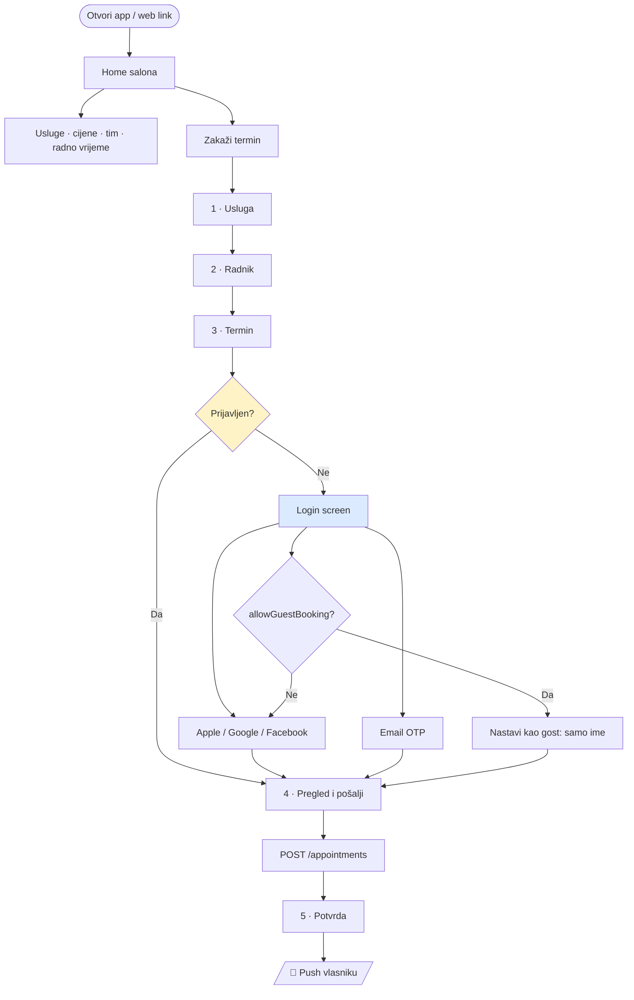

# Auth & Login Flow

Prijava klijenta: Apple, Google, Email i Facebook — sa identity modelom za multi-tenant sistem.

| | |
|---|---|
| **Verzija** | v2 — Supabase Auth, bez broja telefona |
| **Datum** | 21.08.2026. |
| **Prati** | [01-mvp-spec.md](01-mvp-spec.md) · [02-user-flows-wireframes.md](02-user-flows-wireframes.md) · [04-flutter-tenant-factory.md](04-flutter-tenant-factory.md) |

---

## 0. TL;DR

| | |
|---|---|
| **Provideri — iOS** | Apple · Google · Email (OTP) · Facebook |
| **Provideri — Android** | Google · Email (OTP) · Facebook |
| **Provideri — Web** | Google · Email (OTP) · Facebook |
| **Kad se traži login** | Na **kraju** booking flow-a, ne na ulazu u app |
| **Auth backend** | **Supabase Auth** — jedan projekat za sve tenante |
| **Push** | **Firebase FCM** — samo kao dostavna cijev, bez Firebase Auth-a |
| **Identitet** | Globalan (`AuthIdentity`), `Customer` ostaje per-salon |
| **Broj telefona** | ❌ **Ne traži se.** Push zamjenjuje poziv i SMS |
| **Apple konfiguracija** | Sve na **našem** Developer accountu → `fastlane` skriptuje capability |
| **Guest booking** | Opciono po salonu (`allowGuestBooking`), default **isključeno** |

**Najveći rizik:** Facebook po flavoru. Vidi §7.4 prije nego ga obećaš klijentu.

---

## 1. Zašto login, i po kojoj cijeni

Registracija je frikcija. Svaki dodatni korak prije "Pošalji zahtjev" gubi klijente. To je i bio razlog originalne odluke "bez accounta".

Ali social login nije registracija u starom smislu — to je **jedan tap**. I ono što se time dobija je značajno:

| Bez logina (v1) | Sa loginom |
|---|---|
| Termini vezani na `deviceId` — reinstall ih briše | Termini prate korisnika kroz uređaje i reinstalacije |
| Ime se unosi pri svakom bookingu | Dolazi iz računa, nikad se ne tipka |
| Nema sigurnog otkazivanja — svako sa uređajem može otkazati | Otkazivanje je vezano na identitet |
| Nema recall-a za pacijente | Recall radi ([05 §6.2](05-vertical-packs.md)) |
| Waitlist notifikacije nesigurne | Waitlist radi pouzdano |
| Klijent u dva naša salona = dva nepovezana zapisa | Jedan identitet, N salona |

**Cijena koju plaćaš:**
- Konverzija na booking padne za procijenjeno **10–20%** ako je login obavezan prije bookinga
- Per-flavor konfiguracija auth providera pri onboardingu (v. §7)
- Facebook: potencijalno Meta app review po tenantu (v. §7.4)
- Politika privatnosti i **brisanje računa** su sad obavezni po store pravilima (v. §8)

### 1.1 Kako se frikcija minimizuje

Tri odluke koje čuvaju konverziju:

1. **Login se traži na kraju, ne na početku.** Klijent slobodno pregleda salon, usluge, cijene, tim i **slobodne termine**. Login se pojavi tek kad pritisne "Pošalji zahtjev" — u momentu kad je već odlučio. Standardni e-commerce pattern, ne pregovara se.

2. **Nikad forma za registraciju.** Nema "unesi email, ponovi lozinku, prihvati uslove". Četiri dugmeta, jedan tap.

3. **Ne traži se broj telefona.** Vidi §3.1 — ovo je jedan cijeli ekran manje u najosjetljivijem momentu flow-a.

> **Šta login NIKAD ne smije blokirati:** home screen, listu usluga, cijene, tim, radno vrijeme, lokaciju, kontakt i prikaz slobodnih termina. Ako klijent sa Instagrama otvori web link i naleti na login wall, izgubio si ga i web kanal je mrtav.

---

## 2. Provideri po platformi

| Provider | iOS | Android | Web | Napomena |
|---|---|---|---|---|
| **Sign in with Apple** | ✅ | ❌ | ⚠️ opciono | Na Androidu tehnički moguć preko web flow-a, ali besmislen |
| **Google** | ✅ | ✅ | ✅ | Najkorišteniji u BiH |
| **Email (OTP kod)** | ✅ | ✅ | ✅ | Naš fallback, i zadovoljava privacy zahtjev iz §8.1 |
| **Facebook** | ✅ | ✅ | ✅ | ⚠️ Vidi §7.4 prije obećavanja |

Redoslijed dugmeta — po očekivanoj upotrebi, ne po abecedi:

```
iOS:      [ Apple ]  [ Google ]  [ Facebook ]  [ Email ]
Android:  [ Google ] [ Facebook ] [ Email ]
Web:      [ Google ] [ Facebook ] [ Email ]
```

Apple je prvi na iOS-u jer je native i najmanje frikcije za iPhone korisnika. Google je prvi na Androidu iz istog razloga.

### 2.1 Email login — OTP, ne lozinka

**Ne koristimo email + lozinka.** Koristimo **6-cifreni kod** poslan na email (Supabase Auth `signInWithOtp`).

Razlozi:
- Nema zaboravljenih lozinki → nema reset flow-a → nema support poziva
- Nema čuvanja hash-eva lozinki → manji sigurnosni teret
- Klijent salona se prijavljuje 3× godišnje — lozinku bi svakako zaboravio
- Zadovoljava Apple privacy zahtjev iz §8.1 (samo ime i email, bez trackinga)

Magic link je alternativa, ali OTP kod je bolji na mobilnom — ne izlazi iz app-a u browser i vraća se.

---

## 3. Kad se login traži — flow



**Ključno:** login se pojavljuje **između koraka 3 i 4**, nakon što je klijent izabrao termin. Tada je već investirao 40 sekundi i login mu je prihvatljiv. Da je bio na ulazu, otišao bi.

Nakon logina klijent se vraća **točno gdje je bio** — izabrani slot je sačuvan u state-u. Ako je slot u međuvremenu zauzet, `409` i vraćanje na korak 3 sa objašnjenjem ([02 §4.3](02-user-flows-wireframes.md)).

### 3.1 Zašto NE tražimo broj telefona

Cutlio ne traži telefon, i to je ispravno. **Push notifikacija zamjenjuje i poziv i SMS.**

| Situacija | Prije (telefon) | Sad (push) |
|---|---|---|
| Salon potvrdio termin | SMS ili Viber poruka | 🔔 Push, besplatno, instant |
| Salon odbio termin | Poziv | 🔔 Push |
| Podsjetnik D-1 i H-3 | SMS po komadu | 🔔 Push, besplatno |
| Termin se pomjera | Poziv | 🔔 Push + vidljivo u "Moji termini" |
| Klijent otkazao | — | 🔔 Push vlasniku |

**Šta se time dobija:**
- **Jedan cijeli ekran manje** u booking flow-u, na najosjetljivijem mjestu
- Nula troška po poruci — SMS gateway u BiH se plaća po komadu
- Nema pitanja verifikacije telefona, nema SMS OTP-a, nema treće frikcije
- Manje ličnih podataka = manji GDPR/ZZOP teret, posebno u dentalnoj vertikali ([05 §7](05-vertical-packs.md))

**Rezidualni rizik i kako se pokriva:**

| Rizik | Pokrivanje |
|---|---|
| Klijent isključi notifikacije | Status termina je uvijek vidljiv u "Moji termini". Prikaži in-app banner ako su notifikacije isključene, sa dugmetom za uključivanje |
| Salon zaista mora nekog dobiti | Vlasnik otkaže termin sa razlogom → klijent dobija push. Ako ne reaguje, termin je `cancelled` i slot je slobodan — što je i cilj |
| Klijent nije došao | `no_show` na `Customer` zapisu. Ponovljeni no-show → vlasnik može tražiti da klijent zove |

> **Telefon i dalje postoji na `Customer` zapisu** — ali ga upisuje **samo salon admin** za klijente koji zovu telefonom i nikad neće imati app ([02 §11](02-user-flows-wireframes.md)). Klijent iz app-a nema telefon i to je u redu.

---

## 4. Identity model

### 4.1 Supabase Auth — jedan projekat za sve tenante

```
Supabase projekat "salon-platform"
│
├── Auth (JEDAN dijeljeni user pool)
│   └── providers: apple, google, facebook, email OTP
│       └── Authorized Client IDs: comma-separated po flavoru (v. §7)
│
├── Postgres
│   ├── RLS policy po salon_id
│   └── availability funkcija
│
├── Storage — logo, cover, galerija, app ikone
│
└── pg_cron + Edge Functions — reminderi, pending expiry, recall
```

Push ide preko **Firebase FCM**, ali **samo kao dostavna cijev**: Supabase Edge Function poziva FCM HTTP v1 API sa service accountom. Firebase Auth se **ne koristi**.

**Zašto ova podjela** — puno obrazloženje je u [01 §16](01-mvp-spec.md), ukratko:
- Availability engine traži SQL (rangeovi, joinovi, exclusion constraints). Postgres to radi, Firestore ne
- RLS daje tenant izolaciju deklarativno, i Supabase JWT claimovi se čitaju direktno u policy — Auth i autorizacija su jedan sistem
- Da je Auth u Firebase-u a baza u Supabase-u, morao bi premoštavati Firebase ID tokene u Supabase JWT-ove. Dodatni pokretni dio i realan izvor bugova
- FCM je jedini pravi cross-platform push, pa Firebase ostaje u igri — ali samo za to

**Šta ovo znači za korisnika:** klijent koji se prijavi Googleom u Barber Studio Vitez app i u Beauty Studio Travnik app ima **isti Supabase user id**. Jedan identitet, N salona. Kad imaš 20 klijenata, imaš i mrežu korisnika koji se ne moraju ponovo registrovati.

**Trade-off koji moraš znati:** ako tenant otkaže ugovor, njegovi korisnici su u tvom Supabase projektu. To je normalno za SaaS, ali mora biti u ugovoru (§8.4).

### 4.2 Entiteti

```
AuthIdentity — globalno, nije vezano na salon
  id
  supabaseUserId           # unique — auth.users.id
  providers                # ['apple','google'] — jedan korisnik može imati više
  email                    # nullable (Apple relay ili skriven)
  emailVerified
  displayName              # nullable — Apple daje samo prvi put
  isAnonymous              # true za guest sesije
  deletedAt                # soft delete za "izbriši račun"
  createdAt
  lastLoginAt
```

> **Nema `phone` polja.** Vidi §3.1.

`Customer` ostaje **per-salon** i dobija vezu na identitet:

```
Customer
  id
  salonId
  authIdentityId           # nullable
  name
  phone                    # nullable — upisuje ga SAMO salon admin za telefonske klijente
  note
  visitCount
  noShowCount
  isVip
  firstSeenAt
  lastVisitAt
```

`authIdentityId` je nullable namjerno — salon admin ručno unosi klijente koji zovu telefonom i nikad neće imati app. Ti klijenti su `Customer` bez `AuthIdentity`, i **oni imaju telefon a nemaju push**. Obrnuto od app klijenata.

`Device` — most do push notifikacija:

```
Device
  id
  salonId
  deviceId
  fcmToken
  platform                 # android | ios | web
  authIdentityId           # nullable prije prijave
  appVersion
  lastSeenAt
```

App se registruje na prvom otvaranju sa anonimnim `deviceId` i FCM tokenom — push radi i prije prijave. Nakon prijave `deviceId` se veže na `authIdentityId`, pa notifikacije prate korisnika kroz uređaje. Jedan korisnik može imati N uređaja — **pošalji push na sve**.

`Appointment`:

```
Appointment
  ...
  customerId               # per-salon Customer
  authIdentityId           # nullable — ko je stvarno rezervisao
  source                   # app | web | manual | guest
```

### 4.3 Ključno pravilo izolacije ⚠️

**Salon A ne smije nikad vidjeti da klijent ide i u salon B.**

`AuthIdentity` je globalan, ali:
- `Customer` je strogo scoped na `salonId` — RLS policy, bez izuzetka
- Nijedan API endpoint ne vraća listu salona za dati `AuthIdentity`
- `visitCount`, `noShowCount`, `isVip` su **per-salon**, ne globalni
- Admin app nikad ne prima `supabaseUserId` ni `AuthIdentity` podatke — samo `Customer`

> Napiši test: autentikuj se kao klijent koji ima termine u dva salona, pozovi admin API salona A, i dokaži da salon B nije vidljiv. Ovo je i pravna i poslovna obaveza — ako salon otkrije da mu vidiš klijentelu kod konkurencije, izgubio si ga.

### 4.4 RLS policy — skica

```sql
-- Klijent vidi samo svoje termine, i samo u salonu iz kojeg app dolazi
create policy "customer reads own appointments"
on appointments for select
using (
  auth_identity_id = (select id from auth_identities
                      where supabase_user_id = auth.uid())
);

-- Anon rola smije čitati javne podatke salona, ali samo aktivnih salona
create policy "public reads active salon services"
on services for select
to anon, authenticated
using (
  is_active
  and exists (select 1 from salons s
              where s.id = services.salon_id and s.status = 'active')
);

-- Salon admin vidi samo svoj salon
create policy "salon admin scope"
on appointments for all
to authenticated
using (salon_id = (auth.jwt() -> 'app_metadata' ->> 'salon_id')::uuid);
```

**`salon_id` za salon admina ide u `app_metadata`** pri kreiranju korisnika — klijent ga ne može mijenjati. `user_metadata` je editabilan od strane korisnika i **ne smije se koristiti za autorizaciju.**

### 4.5 Spajanje računa (account linking)

Klijent se prvi put prijavi Googleom, drugi put Appleom — sa istim emailom. Bez linkinga to su dva računa i dvije historije termina.

**Faza 1 pristup:** Supabase Auth ima `MAILER_AUTOCONFIRM` / identity linking ponašanje gdje se identiteti sa istim verifikovanim emailom spajaju automatski. Uključi to i **testiraj eksplicitno** — ponašanje se razlikuje po verziji.

Ako se ne spoje automatski, app prikaže:

> *"Već imate račun preko Googlea. Prijavite se Googleom."*

Manuelni `linkIdentity()` flow je Faza 2 — traži pažljiv UX i lako se pokvari.

**Apple je poseban slučaj:** ako korisnik izabere "Hide My Email", email je relay adresa i **ne može se spojiti** sa Google računom. To je Appleov dizajn, ne bug. Prihvati da će mali dio korisnika imati dva računa.

---

## 5. Guest booking — ventil, ne default

`SalonSettings.allowGuestBooking` (bool, default `false`).

Kad je `true`, na login ekranu se pojavi i:

```
─────────── ili ───────────
      Nastavi kao gost
```

Gost unosi **samo ime**. Backend kreira anonimni `AuthIdentity` (`isAnonymous: true`, Supabase `signInAnonymously`) vezan na `deviceId`.

**Gost i dalje dobija push** — `Device` je registrovan sa FCM tokenom prije prijave, pa potvrda i reminderi rade. To je razlog zbog kojeg guest mod nije bezvrijedan i zbog kojeg telefon nije potreban ni ovdje.

**Kad ga uključiti:**
- Salon eksplicitno traži maksimalno jednostavan flow
- Mjerenja pokažu drop-off na login ekranu
- Web kanal (Instagram, QR) ima mjerljivo nižu konverziju od app-a

**Kad ga ne uključivati:**
- Stomatologija — pacijent bez identiteta ne može dobiti recall, a recall je cijela vrijednost te vertikale
- Saloni koji koriste waitlist ili VIP slotove

> Gost je legitimna opcija, ali svjesna. Nemoj ga uključiti "za svaki slučaj" — izgubiš pola koristi od logina.

---

## 6. Flutter implementacija

### 6.1 Paketi

| Namjena | Paket |
|---|---|
| Auth + DB + Storage | `supabase_flutter` |
| Google native | `google_sign_in` → `supabase.auth.signInWithIdToken` |
| Apple native | `sign_in_with_apple` → `signInWithIdToken` |
| Facebook | `flutter_facebook_auth` → `signInWithIdToken` |
| Email OTP | `supabase.auth.signInWithOtp` + `verifyOTP` |
| Push | `firebase_messaging` (samo FCM, bez Firebase Auth) |
| Secure storage | `flutter_secure_storage` |

> **Native, ne web-view OAuth.** `signInWithIdToken` uzima nativni ID token od Googlea/Applea i predaje ga Supabaseu. To je jedan tap bez izlaska iz app-a. Web-view OAuth flow radi, ali izgleda jeftino i Apple ga ne voli.

### 6.2 Arhitektura — provideri su konfiguracija

Isto pravilo kao za vertikale ([05 §2](05-vertical-packs.md)): **koji provideri se prikazuju nije hardkodirano u ekranu.**

```dart
// packages/core_domain/lib/auth_config.dart
class AuthConfig {
  final Set<AuthProvider> enabled;   // iz tenant.yaml + runtime override
  final bool allowGuest;             // iz SalonSettings

  /// Filtrira po platformi — Apple samo na iOS, itd.
  List<AuthProvider> forPlatform(TargetPlatform p) { ... }
}

enum AuthProvider { apple, google, facebook, email }
```

Login ekran renderuje `authConfig.forPlatform(...)` i ništa ne zna o tome koji provideri postoje. Isključivanje Facebooka za jednog tenanta je promjena configa, ne builda.

### 6.3 Repository sloj

```dart
abstract class AuthRepository {
  Stream<AuthState> get authState;
  Future<AuthResult> signInWithApple();
  Future<AuthResult> signInWithGoogle();
  Future<AuthResult> signInWithFacebook();
  Future<void> requestEmailOtp(String email);
  Future<AuthResult> verifyEmailOtp(String email, String code);
  Future<AuthResult> continueAsGuest({required String name});
  Future<void> signOut();
  Future<void> deleteAccount();          // obavezno, v. §8.2
}
```

Supabase tipovi **ne smiju** procuriti iznad ovog sloja. Ako kasnije pređeš na .NET backend sa vlastitim JWT-om, mijenjaš implementaciju, ne app.

### 6.4 Backend autorizacija

Supabase klijent automatski nosi JWT u svakom zahtjevu. Za Edge Functions i bilo koji vlastiti API:

1. Verifikuj JWT (Supabase JWKS)
2. Izvuci `sub` (= `supabaseUserId`) i `app_metadata.salon_id` gdje postoji
3. Nađi ili kreiraj `AuthIdentity` po `supabaseUserId`
4. Nađi ili kreiraj `Customer` za `(salonId, authIdentityId)`
5. Sve dalje scope-uj po `salonId`

**Nikad ne vjeruj `salonId` iz klijenta bez provjere.** Za client app `salonId` je ukucan u build, ali napadač ga može promijeniti. Provjeri da salon postoji i da je `active`, i **nikad** ne dopusti čitanje podataka drugog salona.

---

## 7. Konfiguracija po flavoru — realan trošak ⚠️

Dodaj ovo u onboarding checklist u [04 §9](04-flutter-tenant-factory.md).

**Dobra vijest:** Supabase Auth prima **više client ID-eva po provideru** kao comma-separated listu. Znači jedan Supabase projekat servira N flavora bez novog auth setupa po klijentu — dodaje se samo novi client ID u listu.

### 7.1 Google Sign-In
- Android: OAuth client po `applicationId` + **SHA-1 debug i release** ključa
- iOS: OAuth client po bundle ID-u + `REVERSED_CLIENT_ID` URL scheme u `Info.plist`
- Supabase → Auth → Google → **Client IDs**: dodaj novi ID u comma-separated listu. **Web client ID mora biti prvi u listi**

**Trošak:** ~5 min po flavoru, skriptovano.

> Najčešća greška: zaboravljen **release** SHA-1. Google login radi u debugu, pada u produkciji. Provjeri na signed buildu prije submissiona.

### 7.2 Sign in with Apple
- `Sign In with Apple` capability na App ID-u
- Supabase → Auth → Apple → **Client IDs**: dodaj bundle ID u comma-separated listu
- Private email relay: verifikuj svoj sending domen u Apple konzoli **jednom za sve tenante**, inače Apple ne prosljeđuje mailove na relay adrese

**Trošak:** ~2 min po flavoru, **potpuno skriptovano.**

Pošto svi App ID-evi žive na **našem** Apple Developer accountu ([04 §6.2](04-flutter-tenant-factory.md)), capability se dodaje `fastlane`-om u istom potezu kao provisioning:

```ruby
lane :provision_tenant do |options|
  produce(
    app_identifier: options[:bundle_id],
    app_name: options[:app_name],
    enable_services: { sign_in_with_apple: "on" }
  )
  match(type: "appstore", app_identifier: options[:bundle_id])
end
```

> ⚠️ Supabase podrška za **više Apple client ID-eva** je manje dokumentovana od Google varijante. **Testiraj to na drugom flavoru prije nego uzmeš trećeg iOS klijenta.** Ako ne radi, fallback je Apple web OAuth flow sa jednim Service ID-om za sve tenante — manje elegantno, ali funkcionalno.

### 7.3 Email OTP
Ništa po flavoru. Jedan Supabase Auth za sve tenante. Email template može nositi naziv salona.

**Trošak:** 0 min po flavoru. Najvrjedniji provider u setu.

### 7.4 Facebook — pročitaj prije nego obećaš klijentu ⚠️

Meta dokumentacija je protivrječna oko dijeljenja jednog App ID-a preko više bundle-ova:

- Jedan Facebook App ID **tehnički radi** za Login na više iOS bundle ID-eva i Android package name-ova
- Ali Metina politika o bundle restrikcijama navodi da app ID može imati **maksimalno jedan odobren iOS i Android app bundle**
- **Deep linking podržava samo jedan package name/class name** po app ID-u

Uz to, Facebook Login izvan dev moda traži **Meta app review** za `public_profile` i `email`, sa politikom privatnosti i data deletion callbackom — po Facebook App-u.

| Scenario | Trošak po klijentu | Rizik |
|---|---|---|
| **Jedan FB App za sve flavore** | ~0 min | Metina bundle politika može pauzirati app ID. Deep linking radi samo za jedan flavor |
| **Jedan FB App po flavoru** | **30–60 min + Meta review 1–5 dana** | Nizak, ali skalira linearno sa klijentima |

**Preporuka:** implementiraj Facebook u kodu i pusti ga kroz `AuthConfig`, ali:

1. **Testiraj scenario "jedan FB App za sve"** na prva dva flavora prije nego ga uvedeš u ponudu
2. Drži `facebook` **isključen po defaultu** u `tenant.yaml` i uključuj ga po zahtjevu
3. Ako Meta zakomplikuje, isključi ga bez novog builda — Google + Apple + Email pokriva praktično sve korisnike u BiH

> Iskreno: Facebook je u ovom setu provider sa najgorim odnosom vrijednosti i troška. Tražio si ga i implementiran je, ali ako onboarding počne kasniti zbog Meta review-a, to je prvo što treba pasti.

### 7.5 FCM po flavoru
Ostaje kao i prije: Firebase projekat sa po jednom **app** registracijom za svaki `applicationId` → `google-services.json` / `GoogleService-Info.plist` po flavoru. FCM veže token na `applicationId`, pa zajednički fajl znači da push ne radi.

**Trošak:** ~3 min po flavoru, skriptovano.

### 7.6 `tenant.yaml` — dopuna

```yaml
auth:
  providers:
    apple: true          # samo iOS, ignoriše se na Androidu
    google: true
    email: true
    facebook: false      # default off — v. §7.4
  allowGuestBooking: false

  # per-tenant, ako se ide scenario "FB App po flavoru"
  facebookAppId: ""
  facebookClientToken: ""
```

---

## 8. Store i pravni zahtjevi

Login uvodi obaveze koje app bez logina nije imala. **Bez ovoga review pada.**

### 8.1 Apple Guideline 4.8 — privacy-ekvivalentna opcija

Apple je 2024. ublažio pravilo: Sign in with Apple **nije više striktno obavezan**. Ali ako app koristi third-party/social login, **mora nuditi i alternativnu opciju** koja:

1. ograničava prikupljanje podataka na **ime i email adresu**
2. omogućava korisniku da **zadrži email privatnim**
3. **ne prati** korisnika kroz app

**Kako to zadovoljavamo:** nudimo Sign in with Apple na iOS-u. Naš Email OTP takođe zadovoljava sva tri uslova (naš servis, samo ime i email, bez trackinga), pa imamo dva nezavisna načina da prođemo 4.8.

> Ne izostavljaj Apple sa iOS-a "jer 4.8 više nije obavezan". Formalno prolaziš, ali riskiraš raspravu sa review timom po svakom flavoru — a rasprave sa review timom su nam ionako najveći rizik ([04 §6.2](04-flutter-tenant-factory.md)).

### 8.2 Brisanje računa je obavezno

Apple i Google zahtijevaju da app koja omogućava kreiranje računa omogući i **brisanje računa iz same app-e** — ne samo preko emaila ili sajta.

Implementacija:
- Ekran `Moj račun → Izbriši račun`
- Dvostruka potvrda sa jasnim tekstom šta se briše
- Backend: soft delete `AuthIdentity.deletedAt`, anonimizacija `Customer.name`, **čuvanje `Appointment` zapisa** za statistiku salona (bez ličnih podataka)
- Supabase: `auth.admin.deleteUser`
- **Revoke tokena za Apple** — Apple to eksplicitno zahtijeva
- Budući `confirmed` termini se otkazuju i vlasnik dobija push

> Ovo nije opciono i nije Faza 2. Bez ekrana za brisanje računa iOS submission pada.

### 8.3 Politika privatnosti i data safety
- Javna URL politike privatnosti — **obavezna** sad kad se prikuplja email
- Google Play **Data safety** i Apple **App Privacy** — navesti: email, ime, identifikatori. **Ne navodi telefon** — ne prikupljamo ga od klijenta
- Facebook zahtijeva **data deletion callback URL** ako je uključen
- Za `dental` i `health`: sabira se sa zahtjevima iz [05 §7](05-vertical-packs.md), ne zamjenjuje ih

> Izbacivanje telefona iz klijentskog flow-a **smanjuje** ovaj teret. Manje podataka, manje obaveza, kraći formulari.

### 8.4 Ugovor sa klijentom
Salon je controller za `Customer` podatke, ti si processor. Ali `AuthIdentity` je **tvoj** globalni pool — posebna kategorija koju DPA mora pokriti eksplicitno. Traži pravni pregled prije prvog klijenta sa loginom.

---

## 9. Uticaj na build order

Auth ide u **Sprint 2**, prije push notifikacija (jer `Device` visi na `AuthIdentity`).

### Dopuna Sprint 1
- `AuthIdentity` entitet + `Customer.authIdentityId`, `Device.authIdentityId`
- `AuthRepository` interfejs u `core_api` (bez implementacije)
- `AuthConfig` u `core_domain` + filtriranje po platformi

### Sprint 2 — auth
1. Supabase Auth provideri uključeni (Apple, Google, Email OTP) + comma-separated client ID-evi
2. Google native sign-in — **provjeri release SHA-1**
3. Apple native sign-in — `fastlane` capability, na našem accountu
4. Email OTP flow (`signInWithOtp` + `verifyOTP`)
5. Login screen sa `AuthConfig` filtriranjem po platformi
6. RLS policy + **test izolacije: klijent u dva salona, dokaži da salon A ne vidi salon B** ⚠️
7. `AuthIdentity` upsert + `Customer` upsert po `(salonId, authIdentityId)`
8. **Ekran "Moj račun" + brisanje računa** + Apple token revoke
9. FCM setup po flavoru + `Device` registracija vezana na `AuthIdentity`
10. Push: novi zahtjev → vlasnik, potvrda/odbijanje → klijent
11. Guest flow za `allowGuestBooking: true`
12. Facebook login — **iza flaga**, testiraj scenario iz §7.4 na dva flavora

> Koraci 6 i 8 se najčešće preskaču. 6 je poslovni rizik (salon otkrije da mu vidiš klijentelu kod konkurencije), 8 je odbijeni submission.

---

## 10. Ključne odluke

| Odluka | Obrazloženje |
|---|---|
| **Login se traži na kraju booking flow-a, ne na ulazu** | Klijent koji je izabrao termin prihvata login; onaj na ulazu odlazi |
| **Pregled salona i slobodnih termina nikad ne traži login** | Inače je web kanal (Instagram, QR) mrtav |
| Nema forme za registraciju — samo social + Email OTP | Četiri dugmeta, jedan tap |
| **Email login je OTP kod, ne lozinka** | Nema reset flow-a, nema support poziva, zadovoljava 4.8 |
| **Ne tražimo broj telefona od klijenta** | Push zamjenjuje poziv i SMS. Jedan ekran manje, nula troška po poruci, manji GDPR teret. Cutlio radi isto |
| Telefon ostaje na `Customer`, ali ga upisuje samo salon admin | Za klijente koji zovu telefonom i nikad neće imati app |
| **Supabase Auth, ne Firebase Auth** | Auth i RLS su jedan sistem; premoštavanje Firebase tokena u Supabase JWT je nepotreban pokretni dio |
| **Firebase samo za FCM** | Jedini pravi cross-platform push. Koristi se kao cijev, ne kao auth |
| **Jedan Supabase projekat za sve tenante** | Dijeljeni Auth pool → jedan identitet kroz N salona |
| `AuthIdentity` globalan, `Customer` per-salon | Salon A ne smije vidjeti da klijent ide u salon B |
| **`salon_id` ide u `app_metadata`, nikad `user_metadata`** | `user_metadata` je editabilan od korisnika — ne smije nositi autorizaciju |
| Native `signInWithIdToken`, ne web-view OAuth | Jedan tap bez izlaska iz app-a |
| `allowGuestBooking` default **off**, ventil po salonu | Guest ukida pola koristi od logina — svjesna odluka |
| Gost i dalje dobija push preko `deviceId` | Zato guest mod nije bezvrijedan i zato telefon nije potreban ni ovdje |
| **Sign in with Apple ostaje na iOS-u** iako 4.8 nije striktan | Par minuta rada protiv rasprave sa review timom po svakom flavoru |
| **Ekran za brisanje računa od dana jedan** | Bez njega iOS submission pada |
| Provideri su konfiguracija, ne kod u ekranu | Isključivanje Facebooka ne smije tražiti novi build |
| **Facebook default off, iza flaga** | Metina bundle politika je nejasna; najgori odnos vrijednosti i troška |
| Bez manuelnog account linkinga u Fazi 1 | Lako se pokvari; Apple relay se svakako ne može spojiti |

---

## Izvori

- [Apple (sort of) removes its requirement that apps offer 'Sign in with Apple' support — 9to5Mac](https://9to5mac.com/2024/01/27/sign-in-with-apple-rules-app-store/)
- [Apple Developer Forums — App Review 4.8.0 Design: Login Services](https://developer.apple.com/forums/thread/765145)
- [Supabase Docs — Login with Google (multiple client IDs)](https://supabase.com/docs/guides/auth/social-login/auth-google)
- [Supabase Blog — Native Mobile Auth Support for Google and Apple Sign in](https://supabase.com/blog/native-mobile-auth)
- [Supabase Discussion #32709 — Sign in with Apple multiple client ids](https://github.com/orgs/supabase/discussions/32709)
- [Can you use one Facebook app ID with multiple Apps and Plugins?](https://fbtutorial.com/can-use-one-facebook-app-id-multiple-apps-plugins/)
- [Meta Business Help — Update App IDs to comply with bundle restrictions](https://www.facebook.com/business/help/126840604645326)
