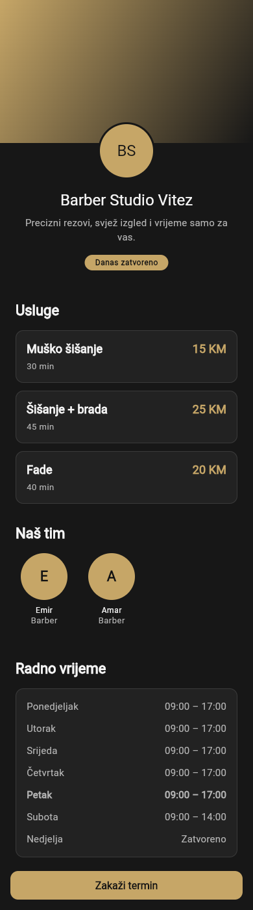
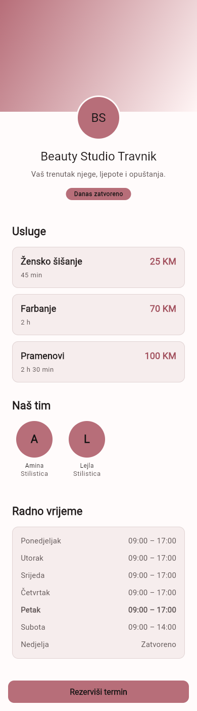

# Task 10 — Client: home ekran sa runtime brandingom

| | |
|---|---|
| **Procjena** | 1–2 dana |
| **Zavisi od** | [06 — VerticalPack](../06-vertical-pack.md), [08 — core_api](08-core-api-repozitoriji.md), [09 — core_ui](09-core-ui-theme-factory.md) |
| **Blokira** | 11 (booking flow) |
| **Reference** | [01 §12](../../docs/01-mvp-spec.md#12-screens) · [02 §2](../../docs/02-user-flows-wireframes.md) · prototip `src/app/pages/LandingPage.tsx` |

## Cilj
Prvi pravi ekran, i prvi **end-to-end dokaz** da lanac baza → repozitorij → provider → tema → tekst radi: isti build sa drugim `SALON_ID` daje drugi salon, druge boje i drugu terminologiju, bez ijedne izmjene koda.

## Definicija gotovog
- [x] `/` prikazuje: logo i cover salona, ime, vertikalno tačan naslov sekcija, listu usluga sa cijenom i trajanjem, tim, i primarni CTA
- [x] **Svaki tekst koji se razlikuje po vertikali ide kroz `vertical.terms.*`** — CTA je `terms.bookCta`, sekcija tima je `terms.staffPlural`, usluge su `terms.servicePlural`. Nijedan takav literal u `.dart` fajlu ekrana
- [x] Ostali tekstovi (dugmad, greške, prazna stanja) idu kroz `.arb`
- [x] Ekran radi **bez prijave** — nigdje ne traži login ([06 §1.1](../../docs/06-auth-login-flow.md))
- [x] Tri stanja pokrivena: učitavanje (skeleton, ne spinner preko praznog ekrana), greška (poruka + retry), prazno (salon bez usluga)
- [x] Slike idu kroz `cached_network_image` — isti brend se učitava na svakom otvaranju
- [x] Dokaz: isti build, dva `SALON_ID`-a, dva screenshota koja se razlikuju po imenu, bojama **i** terminologiji
- [x] Web build iste rute radi i ima ispravan URL

## Koraci
1. Ekran čita `salonProvider`, `servicesProvider`, `employeesProvider`, `verticalProvider` — bez direktnog poziva repozitorija
2. Složi layout po prototipu (`src/app/pages/LandingPage.tsx`) koristeći komponente iz `core_ui`, ne nove ad-hoc widgete
3. Prazno/greška/učitavanje prije nego što se "završi" sretan slučaj
4. Napravi screenshotove za oba tenanta i zakači ih u status blok taska
5. Commit: `feat(client): home ekran sa runtime brandingom i vertikalnom terminologijom`

## Zamke
- Prototip u `src/` je referenca za flow i vizual, **ne izvor komponenti**. Ne prevodi Tailwind klase jedan-na-jedan; koristi tokene iz `core_ui`.
- Ovo je prvi ekran, pa postaje šablon koji će se kopirati. Šta god ovdje bude prečica — literal boja, literal string, poziv repozitorija iz widgeta — bit će ponovljeno petnaest puta.

---

## Status (2026-09-11) — ✅ gotovo

Grana `feat/client-home-runtime-branding`, PR [#11](https://github.com/htuco/salon-booking-platform/pull/11).

### Šta je napravljeno

`/` više nije `PlaceholderScreen` nego `HomeScreen` u `apps/client/lib/src/features/home/`:
hero (cover, logo, ime, opis, živi status), usluge, tim, radno vrijeme, kontakt i sticky CTA.
Pet privatnih widgeta u `widgets/`, `SalonSchedule` za živi status i `formatters.dart` za cijenu
i trajanje.

Ekran čita isključivo providere — `salonProvider`, `servicesProvider`, `employeesProvider`,
`workingHoursProvider`, `verticalProvider`. Nigdje `salonRepositoryProvider` ni `Supabase.instance`.

### Dokaz — screenshotovi, isti build, dva `SALON_ID`-a

```sh
cd apps/client
flutter build web -t lib/demo_main.dart --dart-define=SALON_ID=550e8400-e29b-41d4-a716-446655440000 --output=build/demo-barber
flutter build web -t lib/demo_main.dart --dart-define=SALON_ID=550e8400-e29b-41d4-a716-446655440001 --output=build/demo-beauty
# oba posluzena lokalno, snimljeno u Chromiumu na 390px sirine
```

| Barber Studio Vitez | Beauty Studio Travnik |
|---|---|
|  |  |

Razlika u sve tri dimenzije koje DoD traži, iz istog koda:

| | Barber | Beauty |
|---|---|---|
| Ime | Barber Studio Vitez | Beauty Studio Travnik |
| Boje | zlatna `#C6A667`, tamna tema | roze `#B76E79`, svijetla tema |
| Terminologija | **Zakaži termin** | **Rezerviši termin** |

Usluge se razlikuju i po formatiranju trajanja: barber "40 min", beauty "2 h 30 min" za
pramenove — isti `formatDuration`, druga vrijednost iz baze.

### Dokaz — testovi

```
$ dart run melos run test
[core_domain]: 00:00 +39: All tests passed!
[core_api]:    00:00 +32: All tests passed!
[admin]:       00:01  +4: All tests passed!
[core_ui]:     00:01 +38: All tests passed!
[client]:      00:04 +52 ~1: All tests passed!

165 testova (bilo 140). Novo: 13 widget testova home ekrana (`home_screen_test.dart`) i
12 za raspored i formatere (`home_schedule_test.dart`).

$ dart run melos run analyze
[core_domain]: No issues found!   [core_api]: No issues found!
[core_ui]:     No issues found!   [client]:   No issues found!
[admin]:       No issues found!
```

### Šta su screenshot i test našli, a kod nije pokazao

**Živi status je bio plava mrlja preko brenda.** Prva verzija je koristila
`StatusBadge(tone: StatusTone.info)`, a statusne boje su namjerno brand-neutralne (dogovor iz
taska 09: otkazan termin mora izgledati isto u svakom salonu). Fiksna plava `#1A5FB4` u heroju
preko zlatnog i roze brenda se ne vidi ni u jednom testu — vidjela se na prvom screenshotu.
Status sada ide u `primaryContainer`/`onPrimaryContainer`, pa prati tenanta.

**Kontrast test je mjerio pogrešne parove** i time propuštao stvarne greške:

1. Mjerio je svaki tekst prema `surface`-u. Home ekran ima tekst na obojenim površinama —
   inicijali salona na `primaryContainer` (prijavljeno 1.04:1), živi status na svojoj pozadini
   (1.03:1). Oboje čitljivo; mjerenje pogrešno. Sada traži stvarnu neprozirnu pozadinu penjanjem
   uz stablo, pa pokriva i buduće obojene površine bez nabrajanja izuzetaka.
2. Mjerio je CTA usred Material prelaza iz disabled u enabled stanje: prijavio 2.13:1 na dugmetu
   koje je zapravo 8.07:1 (barber) i 4.92:1 (beauty). Sada pumpa preko trajanja animacije.

**`pumpAndSettle` više ne radi na ovom ekranu.** Skeleton pulsira dok je vidljiv, pa
`pumpAndSettle` istekne i kad je ekran ispravan. Svi testovi koji podižu `/` prešli su na
`pump()`; to je zamka za svaki sljedeći ekran sa skeletonom.

**Postojeći testovi su morali dobiti podatkovne overrides.** Dok je `/` bio placeholder,
`coreApiOverrides` (samo `SALON_ID`) je bio dovoljan. Sada svaki podatkovni provider napravi
repozitorij i posegne za `Supabase.instance` — bez override-a padnu `router_test`,
`widget_test`, `tenant_theme_test` i `vertical_terminology_test`.

### Odluke

- **Sekcija se sakriva i kad njen upit padne**, ne samo kad je prazna (`docs/02 §3` traži
  sakrivanje za prazno). Ekran čija je glavna svrha dugme "Zakaži" ne smije pasti zato što
  katalog nije stigao; booking flow radi bez pregleda kataloga.
- **CTA je vidljiv od prvog framea, samo onemogućen.** Dugme koje iskoči nakon učitavanja pomjeri
  sadržaj pod prstom koji već ide ka njemu.
- **`url_launcher` je uveden iako ga DoD ne traži.** Bez njega je sekcija kontakta spisak teksta
  koji se ne može pozvati, a `docs/02 §3` traži `tel:` i mape.
- **`demo_main.dart`** je alternativni entry point koji puni providere iz `seed.sql` vrijednosti.
  Nije production kod — store build ide kroz `main.dart` — ali je jedini način da se ekran snimi
  na mašini bez Supabase pristupa.

### Ostalo za sljedećeg

- **Ništa nije pokrenuto na Android/iOS uređaju ni emulatoru.** Dokaz je web build u Chromiumu.
  Emulator bi dodatno pokrio `SafeArea` oko sticky CTA i ponašanje `cached_network_image`-a nad
  stvarnim URL-ovima (demo salon nema ni logo ni cover, pa su testirani samo fallbackovi —
  inicijali i gradijent).
- **`url_launcher` akcije nisu pozvane u stvarnom okruženju.** Widget test provjerava da red
  postoji i da je dodirna meta ≥44 px, ne da OS otvori telefon ili mape.
- **Nijedan podatak nije došao sa stvarnog backenda.** `demo_main.dart` ih nosi prepisane iz
  `seed.sql`; prvi stvarni end-to-end prolaz traži Supabase vrijednosti, koje su i dalje
  blokirane istim nalozima kao u tasku 04.
- **Tap na uslugu vodi na `/book/service?serviceId=<id>`** — ruta postoji i URL je ispravan, ali
  tijelo je i dalje `PlaceholderScreen`. Task 11 treba pročitati taj query parametar, inače
  preselekcija usluge iz `docs/02 §3` tiho ne radi.
